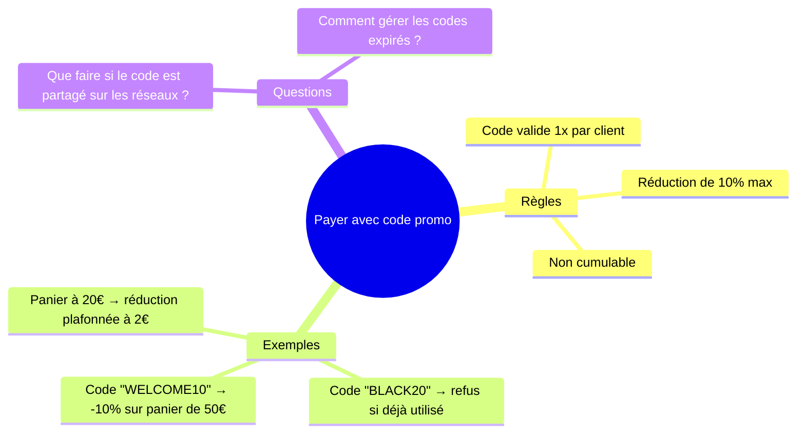

# 🗺️ **Example Mapping**
*L'art de transformer les idées floues en règles claires avec des post-its et des exemples*

**Tags** : `#specification-by-example` `#bdd` `#collaboration` `#user-story` `#refinement`

> *"Un bon exemple vaut mieux qu'une longue spécification."*
> — Coach Sticko

---

## 💡 **Pitch**
**Problème** : Les équipes perdent 30% de leur temps à cause d’exigences mal comprises (étude *Standish Group*).
**Solution** : **Example Mapping**, c’est comme un **GPS pour les user stories** :
- 🧩 **Découpe** une story en règles, exemples et questions.
- 🤝 **Aligne** devs, PO et métiers en 45 min chrono.
- 🎯 **Évite** les malentendus qui coûtent cher en rework.

*Exemple* : Pour une story *"En tant qu’utilisateur, je veux réinitialiser mon mot de passe"*, l’Example Mapping révèle :
- **Règle** : "Le lien de réinitialisation expire après 24h".
- **Exemple** : "Si je clique à 14h00, il fonctionne jusqu’à 14h00 le lendemain".
- **Question** : "Que faire si l’utilisateur est en déplacement sans accès à son email ?".

---

## 📖 **Définition & Origine**
### **Qu’est-ce que c’est ?**
Une **technique de collaboration visuelle** créée par **Matt Wynne** (co-auteur de *"The Cucumber Book"*) pour :
1. **Affiner les user stories** avant le développement.
2. **Capturer les règles métiers** sous forme d’exemples concrets.
3. **Identifier les zones d’ombre** via des questions ouvertes.

Inspiré du **Behavior-Driven Development (BDD)** et des ateliers **Specification by Example**.

### **Les 4 types de cartes** (sur post-its de couleurs différentes) :
| Couleur  | Type          | Description                                                                 | Exemple                                                                 |
|----------|---------------|-----------------------------------------------------------------------------|-------------------------------------------------------------------------|
| 🟢Vert   | **Story**     | La user story ou la règle métier à clarifier.                              | *"En tant que client, je veux annuler ma commande"*                     |
| 🟡Jaune  | **Règle**     | Une contrainte ou une condition métier.                                    | *"Annulation possible seulement si la commande n’est pas expédiée"*     |
| 🔵Bleu   | **Exemple**   | Un cas concret illustrant la règle (scénario happy path ou edge case).     | *"Commande #123 annulée 5 min après achat → remboursement intégral"*    |
| 🟠Orange | **Question**  | Un point bloquant ou une ambiguïté à résoudre.                             | *"Que faire si le produit est déjà en cours de livraison ?"*            |

---

## 🛠️ **Comment animer un atelier Example Mapping ?**
### **Étapes clés** (durée : 30-60 min)
1. **Préparer le terrain**
   - **Participants** : PO, devs, testeurs, expert métier (max 6-8 personnes).
   - **Matériel** : Post-its colorés, tableau blanc (physique ou digital comme Miro/Mural).
   - **Story à affiner** : Choisir une user story **prioritaire mais floue** (ex: *"Gérer les retours produits"*).

2. **Lancer l’atelier**
   - **Écrire la story** (🟢) au centre du tableau.
   - **Demander** : *"Quelles sont les règles pour que cette story soit terminée ?"* → Règles (🟡).
   - **Pour chaque règle** : *"Pouvez-vous donner un exemple concret ?"* → Exemples (🔵).
   - **Repérer les trous** : *"Y a-t-il des cas non couverts ou des questions ?"* → Questions (🟠).

3. **Prioriser les actions**
   - **Tri des questions** : Lesquelles bloquent le développement ? Qui peut y répondre ?
   - **Découper la story** si trop complexe (ex: *"Gérer les retours"* → *"Retour sous 14 jours"* + *"Retour produit endommagé"*).

4. **Clôturer**
   - **Synthèse** : Photographier le tableau et partager les décisions.
   - **Prochaines étapes** : Qui fait quoi pour résoudre les questions ? Quand ?

---
### **Exemple concret** : Story *"Payer en ligne avec un code promo"*

---

## ⚠️ **Difficultés courantes (et comment les éviter)**
| Problème                          | Cause possible                          | Solution                                                                 |
|-----------------------------------|-----------------------------------------|--------------------------------------------------------------------------|
| **Trop d’exemples**               | L’équipe se noie dans les détails.      | Limiter à 3 exemples par règle. Se concentrer sur les **edge cases** critiques. |
| **Débats sans fin**               | Manque de décisionnaire métier.         | Inviter un expert métier **avec pouvoir de décision**.                  |
| **Post-its illisibles**           | Écriture trop petite ou désorganisée.   | Utiliser des **modèles pré-imprimés** ou un outil digital (Miro).       |
| **Questions sans réponse**        | Pas de suivi après l’atelier.           | Désigner un **"owner"** pour chaque question et fixer un délai.         |
| **Story trop large**              | Mauvaise préparation du backlog.        | Découper la story en sous-stories **avant** l’atelier.                  |

---

## ✅ **Avantages**
| Bénéfice                  | Impact mesurable                          |
|---------------------------|-------------------------------------------|
| **Réduction des malentendus** | -40% de rework (source : *Agile Alliance*). |
| **Backlog plus précis**    | Stories **prêtes pour le sprint** en 1 atelier. |
| **Collaboration renforcée** | Devs et métiers **parlent le même langage**. |
| **Décisions documentées**  | Les exemples deviennent des **tests automatisés** (BDD). |
| **Gain de temps**         | 1h d’Example Mapping = 5h de réunions évitées. |

---

## 🎯 **Quand l’utiliser ?**
| Contexte                          | Pertinence (⭐) | Alternative possible               |
|-----------------------------------|----------------|-------------------------------------|
| **Affinement de backlog**         | ⭐⭐⭐⭐⭐        | User Story Mapping                  |
| **Préparation d’un sprint**       | ⭐⭐⭐⭐         | Planning Poker                     |
| **Clarification de règles métiers** | ⭐⭐⭐⭐⭐      | Event Storming                     |
| **Résolution de bugs récurrents** | ⭐⭐⭐           | 5 Why’s ou Fishbone                 |
| **Trois Amigos (PO + Dev + Testeur)** | ⭐⭐⭐⭐⭐        | Atelier des Trois Amigos classique |

---
## 📌 **Checklist pour réussir son Example Mapping**
- [ ] Inviter **au moins 1 expert métier** (pas que des devs !).
- [ ] Préparer **3-5 stories candidates** à affiner.
- [ ] Limiter la durée à **45-60 min max** pour garder l’énergie.
- [ ] Utiliser un **timer** pour éviter les débats trop longs.
- [ ] **Photographier le tableau** et partager les décisions (Slack/Confluence).
- [ ] **Transformer les exemples en tests** (ex: Cucumber, SpecFlow).
- [ ] **Planifier un suivi** pour les questions ouvertes.

---
> *"Une story sans exemples, c’est comme une recette sans ingrédients : tout le monde a sa propre interprétation."*
> — **Coach Sticko** 🧩