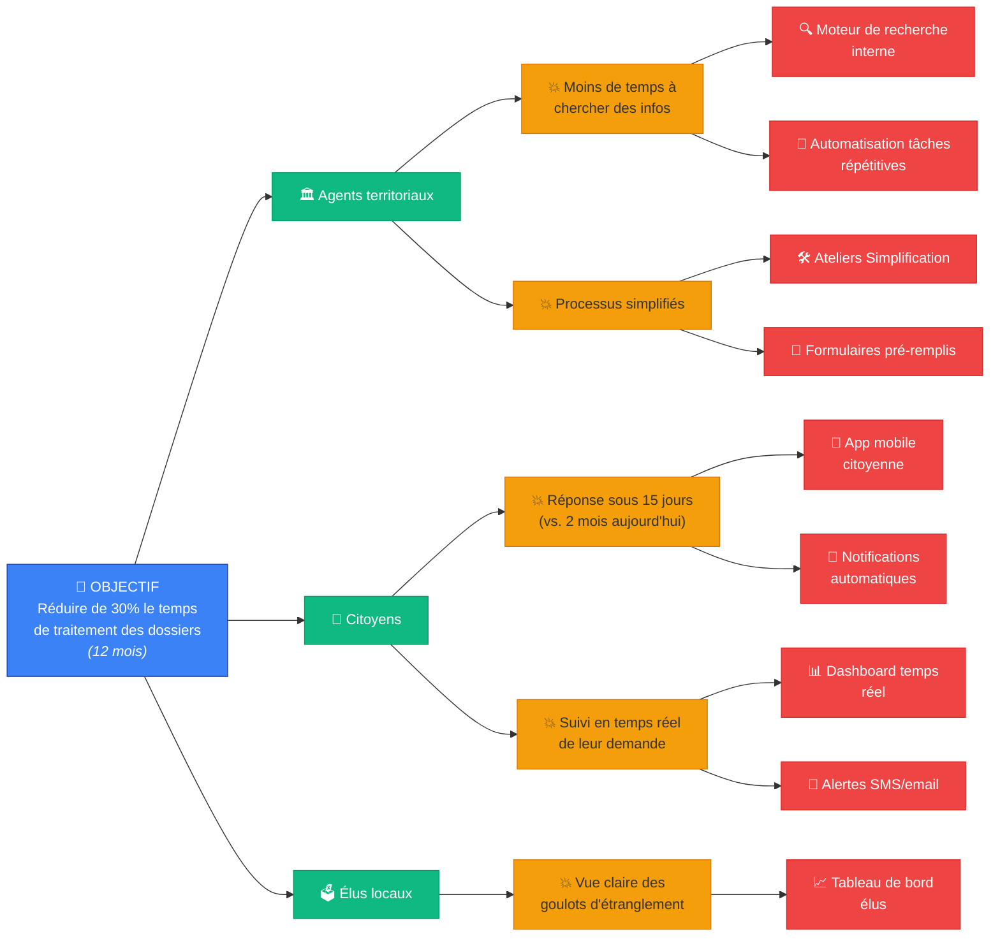
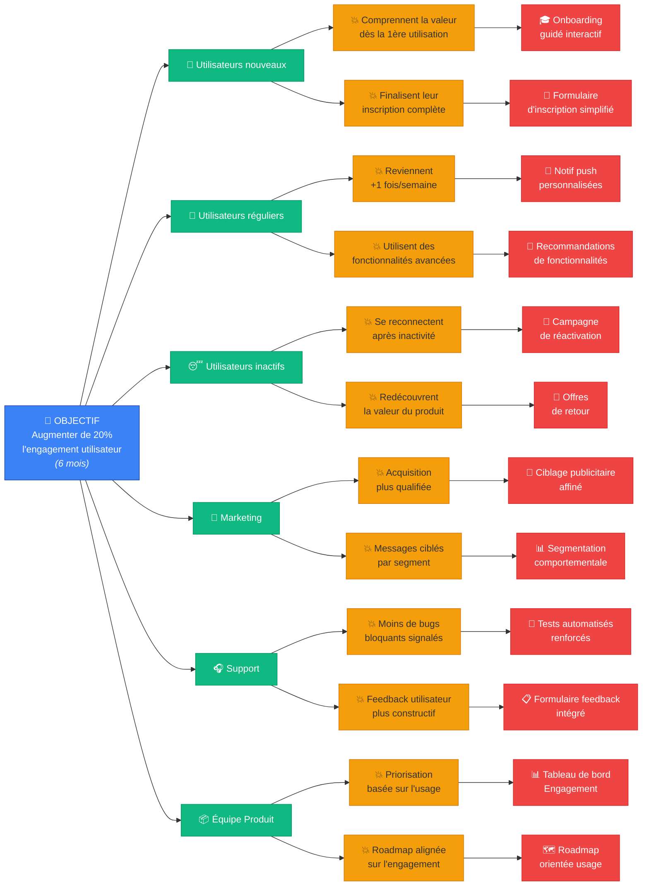
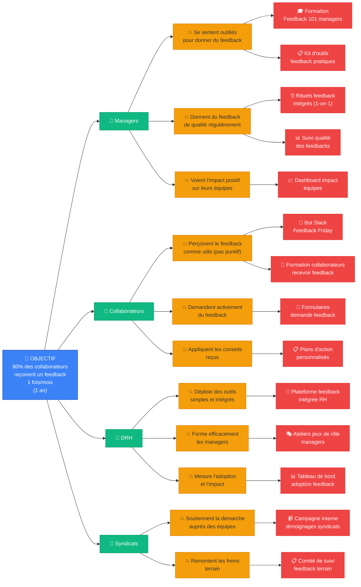
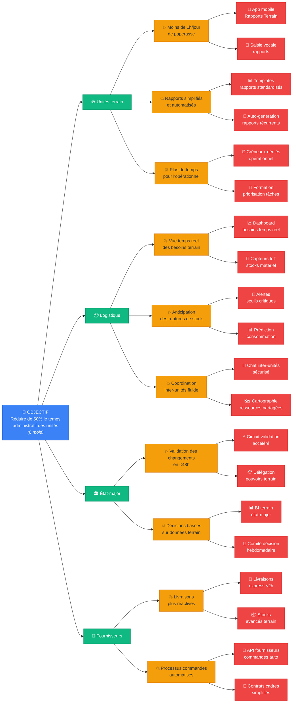
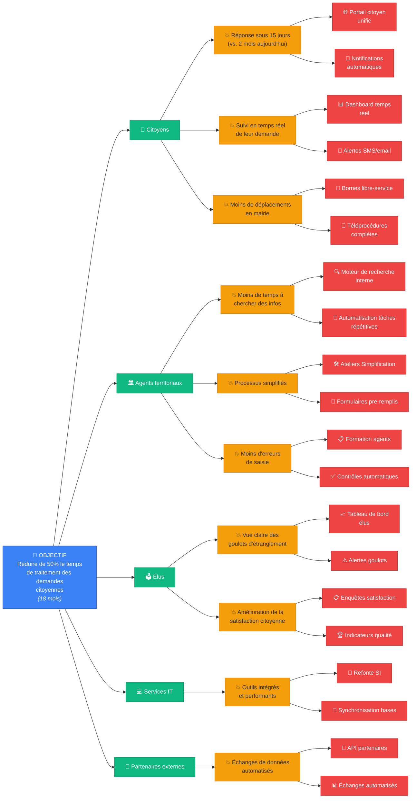

# 🎯 **Impact Mapping : L’Outils Pour Arrêter de Perdre du Temps (Et Commencer à Créer de l’Impact)**

> _"L’Impact Mapping, c’est comme un GPS pour vos projets :_
> - **Sans carte**, vous roulez à l’aveugle.
> - **Avec une mauvaise carte**, vous prenez des détours.
> - **Avec une bonne carte**, vous arrivez plus vite,
>   _et tout le monde sait pourquoi on va là._
>   _Alors, prêt à tracer la vôtre ?"_
> — **Coach Sticko** 🎯🗺

_"Vos équipes développent des fonctionnalités..._ > _que personne n’utilise._ > _Vos projets RH ne changent rien au terrain._ > _Vos processus administratifs alourdissent le travail_ > _au lieu de le simplifier._
_Le problème ?_ > **Vous confondez _activité_ et _impact_.**
_L’Impact Mapping, c’est :_

- **Un atelier de 1h30** pour aligner tout le monde.
- **Une carte visuelle** qui montre _qui_ peut influencer _quoi_.
- **Un filtre anti-bullshit** : si une action n’a pas d’impact clair, on la jette.

_Dans ce dossier :_

- **Le principe** : pourquoi ça marche (et pourquoi vos équipes vont adorer).
- **5 exemples concrets** (IT, RH, Armée, Médical, Administratif) avec des templates.
- **Les pièges** (et comment les éviter).
- **Un déroulé type** pour animer votre atelier.

---

## 🗺 **L’Impact Mapping en 1 Image (À Afficher Dans Votre Salle de Réunion)**

**→ La règle d’or :**
> _"Si un livrable (D) n’a pas de lien clair avec un impact (C),_
> _ou si un impact n’est pas lié à un acteur (B),_
> **→ ON LE SUPPRIME."**

---

## 🎯 **Pourquoi Ça Marche ? (La Science Derrière l’Impact Mapping)**

| **Problème Classique**                  | **Comment l’Impact Mapping Résout Ça**                                       | **Preuve Scientifique / Théorie**                     |
| --------------------------------------- | ---------------------------------------------------------------------------- | ----------------------------------------------------- |
| _"On développe des trucs inutiles."_    | **Focalisation sur l’impact** (pas sur les features).                        | _Lean Startup_ (Eric Ries) : _"Build-Measure-Learn"_. |
| _"Les équipes ne sont pas alignées."_   | **Atelier collaboratif** avec une carte visuelle partagée.                   | _Théorie des Cartes Mentales_ (Tony Buzan).           |
| _"On oublie les utilisateurs finaux."_  | **Identification explicite des acteurs** (pas juste les "users" génériques). | _Design Thinking_ (IDEO).                             |
| _"Les projets prennent trop de temps."_ | **Priorisation naturelle** : on élimine ce qui n’a pas d’impact clair.       | _Loi de Pareto_ (80/20).                              |
| _"Les décisions sont prises en silos."_ | **Atelier cross-fonctionnel** (métiers + tech + management).                 | _Socio-Technique_ (Eric Trist).                       |

---

## 🛠 **Déroulé Type d’un Atelier Impact Mapping (90 min)**

| **Étape**        | **Durée** | **Activité**                                                                                       | **Outils**                          | **Piège à Éviter**                                             |
| ---------------- | --------- | -------------------------------------------------------------------------------------------------- | ----------------------------------- | -------------------------------------------------------------- |
| **1. Cadre**     | 10 min    | Expliquer le _Pourquoi_ de l’atelier + règles (ex : _"Pas de critiques, pas de portables"_).       | Post-it, timer.                     | Ne pas sauter cette étape (risque de hors-sujet).              |
| **2. Objectif**  | 15 min    | Définir **UN SEUL objectif** (SMART). Ex : _"Réduire de 30% le temps de traitement des dossiers"_. | Canvas d’objectif, vote par points. | Objectif trop vague (_"Améliorer l’expérience"_).              |
| **3. Acteurs**   | 20 min    | Lister **tous les acteurs** qui peuvent influencer l’objectif (internes + externes).               | Personas, carte d’empathie.         | Oublier les acteurs indirects (ex : _"le service juridique"_). |
| **4. Impacts**   | 20 min    | Pour chaque acteur : _"Comment peut-il nous aider (ou nous bloquer) à atteindre l’objectif ?"_     | Post-it de couleurs, mind map.      | Confondre _impacts_ et _solutions_.                            |
| **5. Livrables** | 15 min    | _"Qu’est-ce qu’on pourrait faire pour générer ces impacts ?"_ (prioriser avec vote par points).    | Matrice impact/effort, dot voting.  | Tomber dans le _"solutionning"_ trop tôt.                      |
| **6. Plan**      | 10 min    | Définir les **3 prochaines actions** + responsables + deadlines.                                   | Kanban, roadmap visuelle.           | Vouloir tout faire (→ **prioriser**).                          |

**→ Template Miro Prêt à l’Emploi :**
[Lien vers un template Miro Impact Mapping](https://miro.com/templates/impact-mapping/) _(à dupliquer et adapter)_.

---

## 🏥 **5 Exemples Concrets (Avec Templates)**

---

### **1️⃣ IT / Développement Logiciel**

**Contexte :**
_"On développe des fonctionnalités que les utilisateurs n’utilisent pas. Les PO sont frustrés, les devs aussi."_

**Atelier Impact Mapping :**

- **Objectif :** _"Augmenter de 20% l’engagement utilisateur sur notre plateforme d’ici 6 mois."_
- **Acteurs :**
  - Utilisateurs finaux (segmentés : _nouveaux_, _réguliers_, _inactifs_).
  - Équipe marketing (acquisition).
  - Support client (feedback terrain).
  - Équipe produit (priorisation).
- **Impacts (exemples) :**
  - _"Les nouveaux utilisateurs comprennent la valeur dès la 1ère utilisation."_
  - _"Les utilisateurs réguliers reviennent +1 fois/semaine."_
  - _"Le support signale moins de bugs bloquants."_
- **Livrables (priorisés) :**
  1. **Onboarding guidé** (tutoriel interactif).
  2. **Notif push personnalisées** (basées sur le comportement).
  3. **Tableau de bord "Engagement"** pour les équipes.

**Résultat :**

- **Réduction de 40% des features inutiles.**
- **Hausse de 25% de l’engagement** (vs. objectif de 20%).

**Template Spécifique IT :**

**Source :** [Impact Mapping pour le succès business (OCTO)](https://blog.octo.com/impact-mapping-business-success-in-software-development)

---

### **2️⃣ RH / Transformation Culturelle**

**Contexte :**
_"On veut passer à une culture 'feedback continu', mais les managers ne jouent pas le jeu. Les collaborateurs ne voient pas l’intérêt."_

**Atelier Impact Mapping :**

- **Objectif :** _"80% des collaborateurs reçoivent un feedback utile au moins 1 fois/mois d’ici 1 an."_
- **Acteurs :**
  - Managers (premiers relais).
  - Collaborateurs (bénéficiaires).
  - DRH (formation + outils).
  - Syndicats (adoption terrain).
- **Impacts (exemples) :**
  - _"Les managers se sentent outillés pour donner du feedback."_
  - _"Les collaborateurs perçoivent le feedback comme utile (pas punitif)."_
  - _"Les outils de feedback sont simples et intégrés au quotidien."_
- **Livrables (priorisés) :**
  1. **Formation "Feedback 101"** pour managers (avec jeux de rôle).
  2. **Outil léger** (ex : bot Slack _"Feedback Friday"_).
  3. **Campagne interne** (témoignages vidéo de collaborateurs).

**Résultat :**

- **Passage de 30% à 75% de collaborateurs** recevant un feedback mensuel.
- **Baisse de 20% du turnover** (lié au manque de reconnaissance).

**Template Spécifique RH :**

**Source :** [Cartographie stratégique hors sentiers battus (Pablo Pernot)](https://pablopernot.fr/2017/02/cartographie-strategie-impact-mapping-hors-sentiers-battus/)

---

### **3️⃣ Armée / Logistique Opérationnelle**

**Contexte :**
_"Nos unités perdent du temps à cause de processus administratifs lourds. Les soldats sur le terrain râlent, les bureaucrates à l’état-major ne comprennent pas leurs besoins."_

**Atelier Impact Mapping :**

- **Objectif :** _"Réduire de 50% le temps passé par les unités sur les tâches administratives d’ici 6 mois."_
- **Acteurs :**
  - Soldats sur le terrain (utilisateurs finaux).
  - Officiers logistique (intermédiaires).
  - État-major (décideurs).
  - Fournisseurs externes (ex : maintenance).
- **Impacts (exemples) :**
  - _"Les soldats passent moins de 1h/jour sur des rapports."_
  - _"Les officiers logistique ont une vue temps réel des besoins."_
  - _"L’état-major valide les changements de processus en <48h."_
- **Livrables (priorisés) :**
  1. **Application mobile "Rapports Terrain"** (photos + voix → pas de saisie manuelle).
  2. **Cellule "Débureaucratisation"** (soldats + logistique + état-major).
  3. **Simplification des formulaires** (passer de 15 pages à 2).

**Résultat :**

- **Réduction de 60% du temps admin** pour les unités.
- **Meilleure réactivité** en opération (ex : livraison de munitions en 2h vs. 12h).

**Template Spécifique Armée :**

**Source :** Adapté des méthodes de _design organisationnel militaire_ (ex : US Army’s _"Mission Command"_).

---

### **4️⃣ Médical / Hôpital Public**

**Contexte :**
_"Les médecins passent 50% de leur temps sur des tâches administratives. Les patients râlent à cause des délais, les soignants sont en burnout."_

**Atelier Impact Mapping :**

- **Objectif :** _"Réduire de 30% le temps administratif des médecins pour qu’ils passent +20% de temps avec les patients d’ici 1 an."_
- **Acteurs :**
  - Médecins (utilisateurs finaux).
  - Infirmiers (intermédiaires).
  - Administration (processus).
  - Patients (bénéficiaires finaux).
  - Fournisseurs de logiciels (ex : dossier médical).
- **Impacts (exemples) :**
  - _"Les médecins passent <2h/jour sur l’admin (vs. 4h aujourd’hui)."_
  - _"Les infirmiers peuvent pré-remplir les dossiers."_
  - _"Les patients ont un suivi plus personnalisé."_
- **Livrables (priorisés) :**
  1. **Assistant vocal** pour la saisie des comptes-rendus (ex : _"Dictée → texte structuré"_).
  2. **Délégation aux infirmiers** pour les tâches non-médicales (ex : renouvellements d’ordonnances).
  3. **Ateliers "Lean Admin"** avec médecins + administration.

**Résultat :**

- **Gain de 2h/jour par médecin** (soit +30% de temps patient).
- **Baisse de 15% des erreurs administratives** (ex : dossiers incomplets).

**Template Spécifique Médical :**

```mermaid
graph LR
    A["🎯 OBJECTIF<br/>Réduire de 30% le temps<br/>administratif des médecins<br/>+20% temps patient<br/><i>(1 an)</i>"] --> B1["👨‍⚕️ Médecins"]
    A --> B2["👩‍⚕️ Infirmiers"]
    A --> B3["🏢 Administration"]
    A --> B4["🤒 Patients"]
    A --> B5["💻 Fournisseurs logiciels"]
    
    B1 --> C1["💥 Passent <2h/jour<br/>sur l'admin (vs. 4h)"]
    B1 --> C2["💥 Se concentrent<br/>sur le médical"]
    B1 --> C3["💥 Moins de stress<br/>administratif"]
    B2 --> C4["💥 Peuvent pré-remplir<br/>les dossiers"]
    B2 --> C5["💥 Gèrent les tâches<br/>non-médicales"]
    B2 --> C6["💥 Coordination<br/>médecin-infirmier fluide"]
    B3 --> C7["💥 Processus<br/>simplifiés"]
    B3 --> C8["💥 Validation<br/>plus rapide"]
    B3 --> C9["💥 Moins d'erreurs<br/>de saisie"]
    B4 --> C10["💥 Suivi plus<br/>personnalisé"]
    B4 --> C11["💥 Temps d'attente<br/>réduit"]
    B4 --> C12["💥 Meilleure qualité<br/>de soins"]
    B5 --> C13["💥 Outils intégrés<br/>et performants"]
    B5 --> C14["💥 Automatisation<br/>des tâches répétitives"]
    
    C1 --> D1["🎤 Assistant vocal<br/>saisie comptes-rendus"]
    C1 --> D2["📝 Templates<br/>pré-remplis"]
    C2 --> D3["⏰ Créneaux dédiés<br/>consultation"]
    C2 --> D4["🎯 Formation<br/>priorisation médicale"]
    C3 --> D5["🧘 Ateliers<br/>gestion stress"]
    C3 --> D6["📊 Dashboard<br/>charge de travail"]
    C4 --> D7["📋 Délégation tâches<br/>non-médicales"]
    C4 --> D8["🔄 Protocoles<br/>pré-remplissage"]
    C5 --> D9["📚 Formation<br/>compétences étendues"]
    C5 --> D10["✅ Check-lists<br/>tâches déléguées"]
    C6 --> D11["💬 Outil communication<br/>médecin-infirmier"]
    C6 --> D12["📋 Passation<br/>structurée"]
    C7 --> D13["🏭 Ateliers<br/>Lean Admin"]
    C7 --> D14["📄 Simplification<br/>formulaires"]
    C8 --> D15["⚡ Circuit validation<br/>accéléré"]
    C8 --> D16["📱 Validation<br/>mobile"]
    C9 --> D17["🤖 Contrôles<br/>automatiques"]
    C9 --> D18["📊 Détection<br/>anomalies"]
    C10 --> D19["📱 App patient<br/>suivi personnalisé"]
    C10 --> D20["📋 Dossier patient<br/>enrichi"]
    C11 --> D21["📅 Optimisation<br/>planning"]
    C11 --> D22["🔔 Notifications<br/>temps réel"]
    C12 --> D23["📊 Indicateurs<br/>qualité soins"]
    C12 --> D24["🎯 Protocoles<br/>personnalisés"]
    C13 --> D25["🔧 Refonte<br/>système informatique"]
    C13 --> D26["🔄 Intégration<br/>outils existants"]
    C14 --> D27["🤖 Automatisation<br/>rapports"]
    C14 --> D28["📊 IA aide<br/>à la décision"]
    
    style A fill:#3b82f6,stroke:#1e40af,color:#fff
    style B1 fill:#10b981,stroke:#059669,color:#fff
    style B2 fill:#10b981,stroke:#059669,color:#fff
    style B3 fill:#10b981,stroke:#059669,color:#fff
    style B4 fill:#10b981,stroke:#059669,color:#fff
    style B5 fill:#10b981,stroke:#059669,color:#fff
    style C1 fill:#f59e0b,stroke:#d97706,color:#333
    style C2 fill:#f59e0b,stroke:#d97706,color:#333
    style C3 fill:#f59e0b,stroke:#d97706,color:#333
    style C4 fill:#f59e0b,stroke:#d97706,color:#333
    style C5 fill:#f59e0b,stroke:#d97706,color:#333
    style C6 fill:#f59e0b,stroke:#d97706,color:#333
    style C7 fill:#f59e0b,stroke:#d97706,color:#333
    style C8 fill:#f59e0b,stroke:#d97706,color:#333
    style C9 fill:#f59e0b,stroke:#d97706,color:#333
    style C10 fill:#f59e0b,stroke:#d97706,color:#333
    style C11 fill:#f59e0b,stroke:#d97706,color:#333
    style C12 fill:#f59e0b,stroke:#d97706,color:#333
    style C13 fill:#f59e0b,stroke:#d97706,color:#333
    style C14 fill:#f59e0b,stroke:#d97706,color:#333
    style D1 fill:#ef4444,stroke:#dc2626,color:#fff
    style D2 fill:#ef4444,stroke:#dc2626,color:#fff
    style D3 fill:#ef4444,stroke:#dc2626,color:#fff
    style D4 fill:#ef4444,stroke:#dc2626,color:#fff
    style D5 fill:#ef4444,stroke:#dc2626,color:#fff
    style D6 fill:#ef4444,stroke:#dc2626,color:#fff
    style D7 fill:#ef4444,stroke:#dc2626,color:#fff
    style D8 fill:#ef4444,stroke:#dc2626,color:#fff
    style D9 fill:#ef4444,stroke:#dc2626,color:#fff
    style D10 fill:#ef4444,stroke:#dc2626,color:#fff
    style D11 fill:#ef4444,stroke:#dc2626,color:#fff
    style D12 fill:#ef4444,stroke:#dc2626,color:#fff
    style D13 fill:#ef4444,stroke:#dc2626,color:#fff
    style D14 fill:#ef4444,stroke:#dc2626,color:#fff
    style D15 fill:#ef4444,stroke:#dc2626,color:#fff
    style D16 fill:#ef4444,stroke:#dc2626,color:#fff
    style D17 fill:#ef4444,stroke:#dc2626,color:#fff
    style D18 fill:#ef4444,stroke:#dc2626,color:#fff
    style D19 fill:#ef4444,stroke:#dc2626,color:#fff
    style D20 fill:#ef4444,stroke:#dc2626,color:#fff
    style D21 fill:#ef4444,stroke:#dc2626,color:#fff
    style D22 fill:#ef4444,stroke:#dc2626,color:#fff
    style D23 fill:#ef4444,stroke:#dc2626,color:#fff
    style D24 fill:#ef4444,stroke:#dc2626,color:#fff
    style D25 fill:#ef4444,stroke:#dc2626,color:#fff
    style D26 fill:#ef4444,stroke:#dc2626,color:#fff
    style D27 fill:#ef4444,stroke:#dc2626,color:#fff
    style D28 fill:#ef4444,stroke:#dc2626,color:#fff
```

**Source :** Inspiré des méthodes _Lean Healthcare_ (ex : Virginia Mason Medical Center).

---

### **5️⃣ Administratif / Collectivité Territoriale**

**Contexte :**
_"Les citoyens râlent parce que leurs demandes (permis de construire, aides sociales) mettent des mois à être traitées. Les agents sont submergés par les dossiers papier."_

**Atelier Impact Mapping :**

- **Objectif :** _"Réduire de 50% le temps de traitement des demandes citoyennes d’ici 18 mois."_
- **Acteurs :**
  - Citoyens (demandeurs).
  - Agents territoriaux (traitement).
  - Élus (décideurs).
  - Services informatiques (outils).
  - Partenaires externes (ex : Caf, Pôle Emploi).
- **Impacts (exemples) :**
  - _"Les citoyens ont une réponse sous 15 jours (vs. 2 mois aujourd’hui)."_
  - _"Les agents passent moins de temps à chercher des infos."_
  - _"Les élus ont une vue claire des goulots d’étranglement."_
- **Livrables (priorisés) :**
  1. **Portail citoyen unifié** (suivi en temps réel des demandes).
  2. **Automatisation des tâches répétitives** (ex : vérification des pièces jointes).
  3. **Ateliers "Simplification"** avec agents + citoyens (design thinking).

**Résultat :**

- **Réduction de 60% des délais** pour les demandes simples (ex : certificats).
- **Baisse de 25% des appels en mairie** (moins de relances).

**Template Spécifique Administratif :**

**Source :** [Exemple d’Impact Mapping hors IT (Pablo Pernot)](https://pablopernot.fr/2017/02/cartographie-strategie-impact-mapping-hors-sentiers-battus/)

---

## ⚠️ **5 Pièges à Éviter (Et Comment Les Contourner)**

| **Piège**                          | **Pourquoi C’est Dangereux**                                                                          | **Comment l’Éviter**                                                              |
| ---------------------------------- | ----------------------------------------------------------------------------------------------------- | --------------------------------------------------------------------------------- |
| **Objectif trop vague**            | _"Améliorer l’expérience utilisateur"_ → tout et rien à la fois.                                      | Utilisez la formule **SMART** (ex : _"Augmenter le NPS de 20 points en 6 mois"_). |
| **Oublier des acteurs clés**       | Ex : ne pas inclure le _support client_ dans un projet IT.                                            | Faites un **brainstorming large** (même les acteurs indirects).                   |
| **Confondre impacts et livrables** | _"On va faire une appli mobile"_ (livrable) vs. _"Les utilisateurs l’utilisent 3x/semaine"_ (impact). | **Interdisez les solutions** dans la phase "Impacts".                             |
| **Atelier trop long**              | +2h → les participants décrochent.                                                                    | **Limitez à 90 min max** (avec pauses).                                           |
| **Pas de suivi post-atelier**      | La carte finit dans un tiroir.                                                                        | **Désignez un "garant"** + **revues mensuelles**.                                 |

---

## 🎯 **Quand Utiliser l’Impact Mapping ? (Et Quand Pas)**

| **Utilisez-le si...**                            | **Évitez-le si...**                                          |
| ------------------------------------------------ | ------------------------------------------------------------ |
| ✅ Vous avez un **objectif stratégique flou**.   | ❌ Vous voulez **juste une liste de tâches**.                |
| ✅ Vos équipes **ne sont pas alignées**.         | ❌ Vous cherchez **un plan détaillé** (→ roadmap classique). |
| ✅ Vous voulez **éviter les features inutiles**. | ❌ Vous êtes **en crise** (besoin d’action immédiate).       |
| ✅ Vous avez **plusieurs parties prenantes**.    | ❌ Vous travaillez **seul sur un projet simple**.            |
| ✅ Vous voulez **prioriser sans bias**.          | ❌ Vous avez **déjà une solution claire**.                   |

---

**📌 PS : Le "Test des 3 Questions" pour Savoir si Vous Avez Besoin d’un Impact Mapping**

1. **"Est-ce que vos équipes travaillent sur des trucs\*
   _dont personne ne mesure l’impact ?"_
   → **Oui ?\*\* → Il vous faut une carte d’impact.
2. **"Est-ce que vos parties prenantes\*
   _ne sont pas d’accord sur les priorités ?"_
   → **Oui ?\*\* → L’Impact Mapping va les aligner.
3. **"Est-ce que vos projets prennent plus de temps que prévu\*
   _parce qu’on découvre des problèmes en cours de route ?"_
   → **Oui ?\*\* → Une carte d’impact aurait évité ça.
