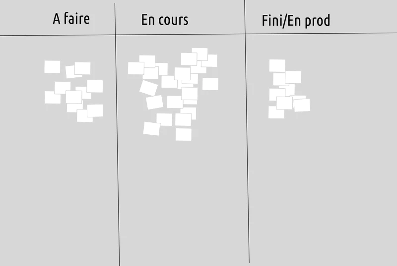
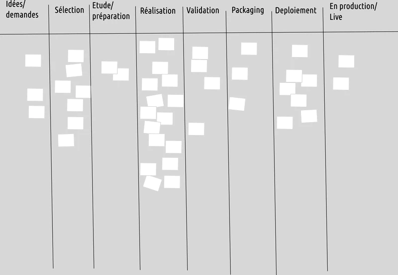
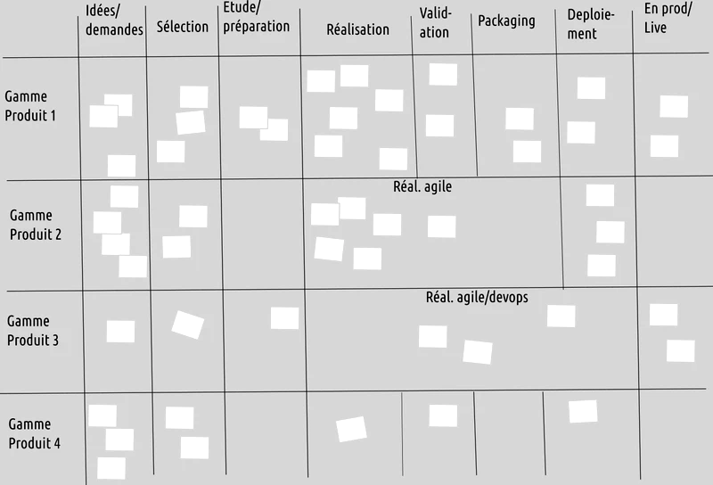
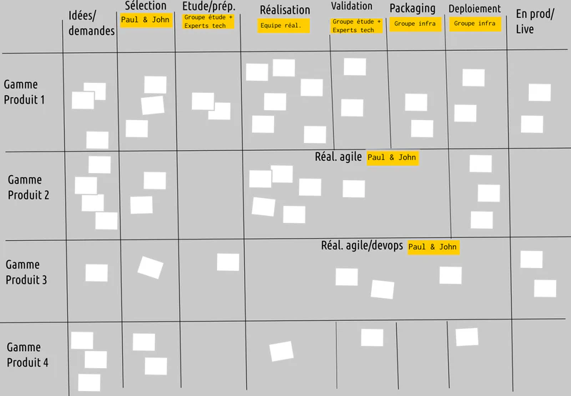
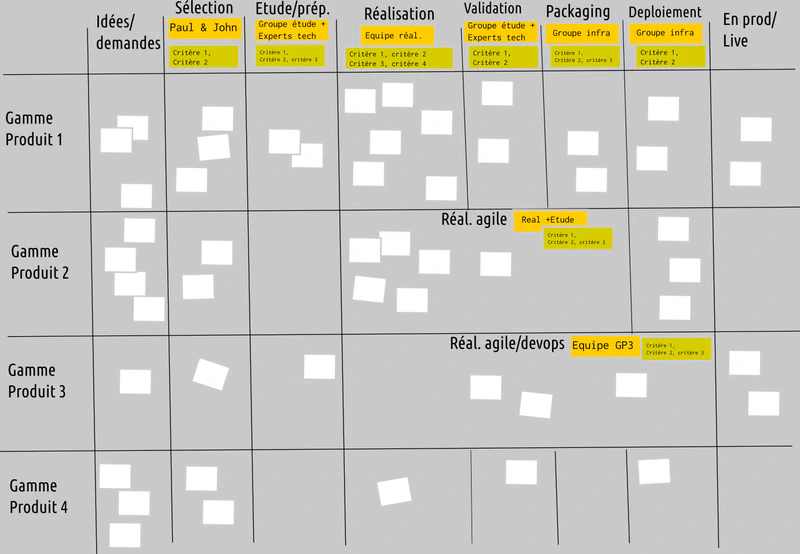
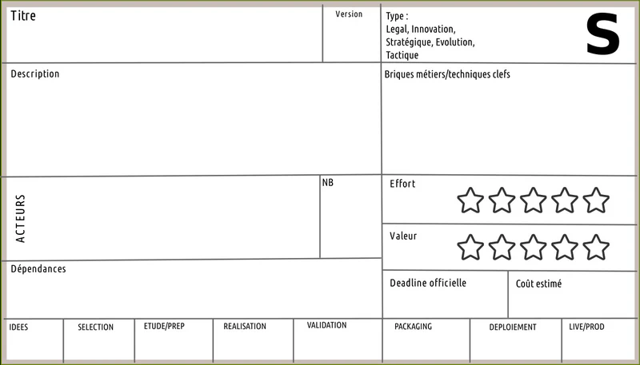
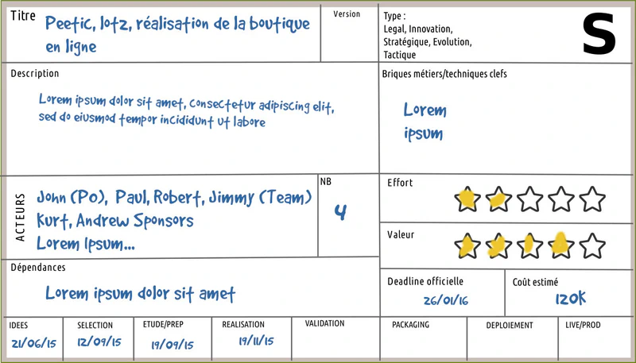
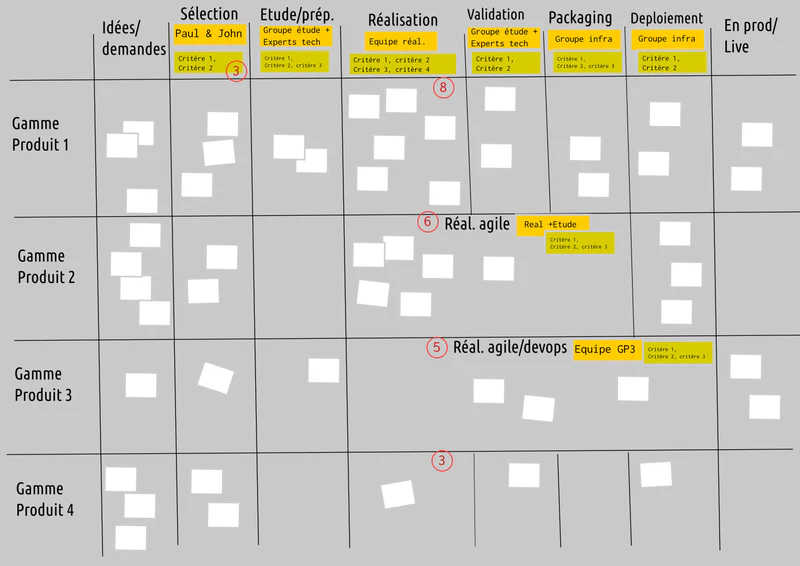
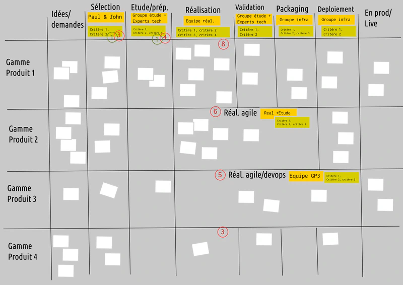
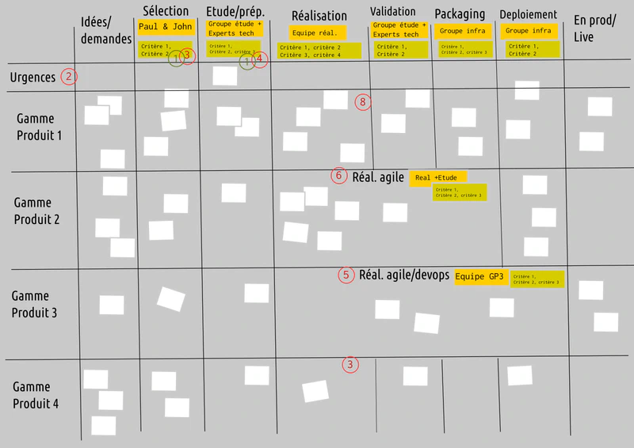

# 🏗️ **Kanban : Le Guide Complet (Avec Graphes, Pièges et Cas Concrets)**

> _"Kanban, c'est comme un GPS pour votre travail : ça ne vous dit pas où aller, mais ça vous montre où vous êtes bloqués et comment fluidifier le trajet."_
> — **Coach Sticko**

---

## 🎯 **Pourquoi Kanban ? (Le Pitch en 30 Secondes)**

Kanban est une **méthode visuelle** pour :
✅ **Rendre le travail visible** (plus de tâches cachées dans les mails).
✅ **Limiter le travail en cours** (WIP) pour éviter la surcharge.
✅ **Améliorer le flux** (moins de blocages, plus de livraisons).
✅ **S’adapter à n’importe quel contexte** (dev, marketing, support, RH…).

**Contrairement à Scrum** :

- **Pas de Sprints** → Le travail coule en continu (_flow_).
- **Pas de rôles imposés** → L’équipe s’auto-organise.
- **Pas de changements radicaux** → On part de l’existant et on améliore.

💡 **Quand l’utiliser ?**
✔ Projets avec **des demandes imprévisibles** (support, maintenance, urgences).
✔ Équipes qui **ne peuvent pas se permettre des itérations fixes** (ex : ops, marketing).
✔ Environnements où **le travail arrive en flux continu** (ex : tickets clients, bugs).

❌ **À éviter si :**

- Vous avez besoin de **livraisons synchronisées** (ex : sortie d’un jeu vidéo avec une date fixe).
- Votre équipe a **besoin de cadence** pour se discipliner (→ Scrum peut être mieux).

---

## 📜 **Définition & Origines : Kanban, C’est Pas Juste un Tableau !**

### **📌 Définition (Selon David J. Anderson, 2010)**

> _"Kanban est une **méthode d’amélioration progressive** qui commence par **visualiser le travail**, puis **limite le travail en cours** pour enfin **optimiser le flux**."_

- **Visualiser** = Tout le travail est **affiché** (pas de tâches cachées).
- **Limiter** = On fixe des **limites WIP** pour éviter l’engorgement.
- **Fluidifier** = On mesure et améliore **le temps de cycle** (_cycle time_).

### **🕰️ Petite Histoire (Sans Vous Endormir)**

- **Années 1940** : **Taiichi Ohno** (Toyota) invente le **Kanban physique** (cartes pour gérer les stocks en _juste-à-temps_).
- **2004** : **David J. Anderson** adapte Kanban au **développement logiciel** (Microsoft).
- **2010** : Publication de _"Kanban: Successful Evolutionary Change for Your Technology Business"_ → Kanban devient **une méthode Agile à part entière**.

💥 **Fun Fact** :
Le mot **Kanban** (看板) signifie _"tableau"_ ou _"enseigne"_ en japonais. À l’origine, c’étaient des **cartes en papier** accrochées aux machines pour signaler les besoins en pièces.

---

## 🎨 **Les 6 Pratiques Clés de Kanban** _(D’après Pablo Pernot & David J. Anderson)_

| **Pratique**                        | **Pourquoi ?**                                                      | **Exemple Concret**                                                                  |
| ----------------------------------- | ------------------------------------------------------------------- | ------------------------------------------------------------------------------------ |
| **1. Visualiser le flux**           | _"On ne peut pas améliorer ce qu’on ne voit pas."_                  | Un tableau avec **4 colonnes** : _À faire → En cours → Review → Terminé_.            |
| **2. Limiter le WIP**               | Trop de travail en cours = **baisse de qualité + stress**.          | _"Max 3 tâches en 'En cours'" → Si 3 tâches sont en cours, on ne prend pas la 4ème._ |
| **3. Gérer le flux**                | Optimiser **la vitesse et la prévisibilité** des livraisons.        | Mesurer le _cycle time_ (temps moyen pour terminer une tâche).                       |
| **4. Rendre les règles explicites** | Éviter les malentendus (_"Je pensais que c’était à toi !"_).        | Afficher **la Definition of Done** pour chaque colonne.                              |
| **5. Boucles de feedback**          | Améliorer **en continu** (comme les rétros en Scrum, mais en flow). | Une **réunion hebdo** pour analyser les blocages et ajuster les limites WIP.         |
| **6. Améliorer collaborativement**  | Kanban = **kaizen** (amélioration continue).                        | _"Ce mois, on réduit le cycle time de 20% en automatisant les tests."_               |

---

## 📊 **Les Graphes Kanban Expliqués aux Enfants** _(Inspiré de Pablo Pernot)_

### **1️⃣ Le Cumulative Flow Diagram (CFD) : Le "Thermomètre" de Votre Flux**

**À quoi ça sert ?**
→ Voir **où les tâches s’accumulent** (goulots d’étranglement).
→ Prévoir **quand une tâche sera terminée** (si le flux est stable).

**Exemple** :

_(Source : Pablo Pernot)_

**Comment le lire ?**

- **Bandes qui s’élargissent** = Trop de travail en cours (WIP).
- **Lignes parallèles** = Flux stable (bon signe !).
- **Cassure brute** = Un blocage majeur (ex : un serveur en panne).

💡 **Astuce Coach Sticko** :
> _"Si votre CFD ressemble à un sapin de Noël, c’est que vous avez trop de WIP. Coupez les branches (limitez le WIP) !"_

---

### **2️⃣ Le Cycle Time vs. Lead Time : La Bataille des Temps**

| **Métrique**   | **Définition**                                                            | **Exemple**                                                                                      | **Objectif**                                |
| -------------- | ------------------------------------------------------------------------- | ------------------------------------------------------------------------------------------------ | ------------------------------------------- |
| **Cycle Time** | Temps **entre le début et la fin** d’une tâche (sans le temps d’attente). | _"On a commencé à coder la feature hier, elle est finie aujourd’hui → Cycle Time = 1 jour."_     | **Réduire** pour livrer plus vite.          |
| **Lead Time**  | Temps **entre la demande et la livraison** (inclut l’attente).            | _"Le client a demandé la feature il y a 2 semaines, livrée aujourd’hui → Lead Time = 14 jours."_ | **Stabiliser** pour prévoir les livraisons. |

📉 **Graphique Type (Pablo Pernot)** :

**Piège à Éviter** :
❌ Confondre **Cycle Time** et **Lead Time** → _"On est super rapides !"_ (oui, mais le client attend depuis 3 semaines…).

---

### **3️⃣ Le Control Chart : Le "Cardio" de Votre Équipe**

**À quoi ça sert ?**
→ Voir si votre flux est **stable et prévisible**.

**Exemple** :

**Comment l’utiliser ?**

- **Ligne verte** = Moyenne du Cycle Time.
- **Lignes rouges** = Limites naturelles (85% des tâches devraient être dans cette zone).
- **Points hors limites** = **Problème** (ex : une tâche a pris 10x plus de temps que la moyenne).

💡 **Cas Réel (Pablo Pernot)** :

> _"Une équipe avait un Control Chart avec des points partout. Après analyse : ils sous-estimaient systématiquement les tâches complexes. Solution : ils ont ajouté une colonne 'Analyse' avant 'En cours' pour mieux estimer."_

---

## ⚠️ **Les 5 Pièges Qui Tuent Kanban** _(Et Comment Les Éviter)_

### **1️⃣ Le Piège du "Kanban = Tableau Trello"**

**Symptôme** :

- Vous avez un tableau, mais **pas de limites WIP**.
- Les tâches **s’accumulent** dans "En cours" sans jamais avancer.

**Solution** :
➡️ **Fixer des limites WIP** (ex : max 3 tâches en "En cours").
➡️ **Afficher les blocages** avec un post-it rouge.

**Exemple (Pablo Pernot)** :

> _"Une équipe avait 15 tâches en cours. Résultat : rien n’avançait. Après avoir limité à 4, leur Cycle Time a chuté de 60%."_

---

### **2️⃣ Le Piège des "Colonnes Poubelles"**

**Symptôme** :

- Une colonne **"En attente"** ou **"Blocage"** devient un **cimetière à tâches**.
- Personne ne s’occupe des blocages.

**Solution** :
➡️ **Ajouter une règle** : _"Toute tâche bloquée depuis >24h doit être discutée en réunion quotidienne."_
➡️ **Créer un "Swarming"** : Quand une tâche est bloquée, **2-3 personnes** se mobilisent pour la débloquer.

---

### **3️⃣ Le Piège du "Kanban Sans Métriques"**

**Symptôme** :

- Vous avez un beau tableau, mais **personne ne mesure rien**.
- Impossible de savoir si ça s’améliore.

**Solution** :
➡️ **Mesurer au moins** :

- Cycle Time (moyen et médian).
- Nombre de tâches terminées/semaine (_throughput_).
  ➡️ **Afficher les graphes** (CFD, Control Chart) **en visible**.

**Exemple (Pablo Pernot)** :

> _"Une équipe mesurait seulement le nombre de tâches terminées. Résultat : ils optimisaient la quantité, pas la qualité. Après avoir ajouté le Cycle Time, ils ont réalisé que 30% des tâches mettaient 10x plus de temps que la moyenne."_

---

### **4️⃣ Le Piège du "Kanban Statique"**

**Symptôme** :

- Votre tableau **n’évolue jamais**.
- Les limites WIP **ne sont jamais remises en question**.

**Solution** :
➡️ **Faire un "Kanban Retrospective"** tous les mois :

- _"Quels blocages reviennent souvent ?"_
- _"Faut-il ajouter/retirer une colonne ?"_
  ➡️ **Expérimenter** : Ex : _"Et si on limitait le WIP à 2 au lieu de 3 ?"_

**Cas Réel (Dynamic Kanban, Pablo Pernot)** :

> _"Une équipe a ajouté une colonne 'Prêt pour la Review' après avoir remarqué que les tâches traînaient en 'En cours' parce que le PO n’était pas dispo pour valider. Résultat : Lead Time réduit de 30%."_

---

### **5️⃣ Le Piège du "Kanban pour Tout"**

**Symptôme** :

- Vous utilisez Kanban **même pour des projets avec des deadlines fixes** (ex : lancement d’un produit).
- Résultat : **pas de prévisibilité**, stress en fin de projet.

**Solution** :
➡️ **Hybrider avec Scrum** si besoin :

- Utiliser des **Sprints pour les livraisons critiques**.
- Garder Kanban pour le **travail continu** (bugs, améliorations).
  ➡️ **Choisir le bon outil** :
- **Kanban pur** → Support, maintenance, flux continu.
- **Scrum/Kanban (Scrumban)** → Projets avec des livraisons régulières mais des demandes imprévisibles.

---

## 🏗️ **Portfolio Kanban : Gérer Plusieurs Projets** _(D'après Pablo Pernot)_

### **📌 Afficher Son Activité**

La première étape d'un Portfolio Kanban est simple : **afficher tous les projets** sur lesquels travaille l'organisation. Pas de doublon, pas de tâches cachées. Chaque projet est représenté par une fiche (pas un post-it, une vraie fiche A5 ou A6).

💡 **Pourquoi c'est disruptif ?**

> _"Juste afficher les projets sur lesquels chacun travaille. C'est déjà révolutionnaire. Vous prenez une matinée pour récolter toute cette information."_

### **📋 Un Brin d'Organisation**

Plutôt qu'un tas informe, donnez une dynamique de lecture (de gauche à droite) avec : **À faire → En cours → Fini**.

Mais rapidement, il faut **afficher la réalité du flux projet**. Interrogez les équipes et placez les vraies étapes. Exemple hybride : _Idées → Sélection → Préparation → Réalisation Agile → Réalisation Agile/DevOps → Live/Prod_.

**Règle d'or** : **Montrer la réalité et que la réalité**. Si le Kanban ne montre pas la réalité, personne n'y accorde d'importance.

### **🏊 Commencer la Gouvernance (Swim Lanes)**

Scindez votre Kanban en **lignes horizontales** (swim lanes) pour refléter votre organisation stratégique :

- Par **domaines métiers** (Finance, RH, IT, Marketing…)
- Par **zones géographiques** (Europe, Amériques, Asie…)
- Par **types de projets** (Innovation, Légal, Maintenance…)
- Par **équipes** (Squad 1, Squad 2…)

### **📜 Des Règles Claires**

Pour faciliter l'implication, précisez :

- **Qui est responsable** de chaque colonne
- **Qui peut manipuler** les éléments
- **Les critères de sortie** d'une colonne à l'autre

Établir ce protocole clarifie les tenants et aboutissants. Vous pouvez appliquer des responsabilités et critères par bloc.

### **📄 La Fiche Projet**

Chaque fiche (quart de page A4) rassemble les éléments essentiels pour la gouvernance :

- **Nom du projet**
- **Deadline estimée**
- **Nombre de personnes affectées**
- **Budget estimé**
- **Type de projet**
- **Acteurs** (sponsors, rôles)
- **Dates d'entrée dans chaque colonne** (inscrites quand la fiche bouge, pas en projection)

### **🚦 Les Limites WIP**

Les **limites WIP** (Work In Progress) contrôlent la capacité du portfolio pour :

- Ne pas faire entrer trop de projets avant d'en avoir terminé
- Optimiser la valeur en limitant le multitâche
- Favoriser l'apprentissage stratégique

**Principe** : _"Commencer à finir, arrêter de commencer"_

Une limite indique le **nombre maximum d'éléments** autorisés par colonne, bloc ou ligne horizontale.

### **⬇️ Limites Basses**

Les **limites basses** garantissent l'existence d'un flux minimum. Il faut _a minima_ des éléments en préparation pour éviter l'assèchement de l'activité de réalisation.

### **🎯 Limites Stratégiques**

Les limites par ligne horizontale indiquent le **poids et la capacité** accordés à chaque domaine. Souvent, ce sont des équipes affectées ou une capacité globale (ex : 3 équipes ici, 4 équipes là).

### **🚨 Les Urgences**

Malgré les limites, il est pertinent d'avoir une **ligne dédiée aux urgences**. Mais attention : **limitez aussi les urgences**. Si tout est urgence, il n'y a pas d'urgence.

### **📊 Combien d'Éléments ?**

**Minimum** : ~20-30 éléments (en dessous, pas assez de dynamique)
**Maximum** : ~150-200 éléments (au-delà, ça devient un sapin de Noël baroque)

**Exemple** : 100 projets de 4 personnes = impact sur 400 personnes. C'est un bon départ !

### **⏱️ Temps de Mise en Place**

- **Monter le Kanban** : 1 à 3 jours
- **Ajouter les règles** : quelques heures
- **Maintenance quotidienne** : 10 minutes/jour
- **Réunion hebdo de gouvernance** : 30 minutes
- **Limites WIP** : À placer après 2-3 mois d'observation

---

## 📈 **Kanban en Action : Cas Concrets** _(Inspirés de Pablo Pernot)_

### **🏥 Cas 1 : Kanban pour un Service Hospitalier (Urgences)**

**Problème** :

- Temps d’attente **trop longs** aux urgences.
- **Stress** des équipes à cause des pics d’affluence.

**Solution Kanban** :

- **Tableau physique** dans la salle de pause :
  - Colonnes : _Arrivée → Triage → Consultation → Soins → Sortie_.
  - **Limite WIP** : Max 5 patients en _"Consultation"_ (sinon, les médecins sont débordés).
- **Métriques** :
  - **Cycle Time** = Temps entre _Triage_ et _Sortie_.
  - **Lead Time** = Temps entre _Arrivée_ et _Sortie_.

**Résultat** :

- Réduction de **40% des temps d’attente** en 3 mois.
- **Moins de burnout** chez les infirmières (moins de multitâche).

💡 **Leçon** :

> _"Kanban marche même hors du numérique ! L’important, c’est de **visualiser le flux réel** (pas un flux idéal)."_

---

### **🎮 Cas 2 : Kanban pour un Studio de Jeux Indé**

**Problème** :

- Les **bugs s’accumulent** et ralentissent le développement.
- Les artistes et devs **ne sont pas synchronisés**.

**Solution Kanban** :

- **2 tableaux** :
  1. **Développement** (features, niveaux).
  2. **Bugs** (avec limites WIP strictes : max 3 bugs "En cours").
- **Règle d’or** :
  - _"Si un bug est critique, il passe devant tout."_
  - _"Pas de nouvelle feature si >5 bugs en attente."_

**Résultat** :

- **90% des bugs résolus en <48h** (contre 1 semaine avant).
- **Meilleure collaboration** entre artistes et devs (moins de _"C’est pas mon problème"_).

---

### **📞 Cas 3 : Kanban pour un Centre d’Appels**

**Problème** :

- **Temps de résolution** des tickets clients trop long.
- **Turnover élevé** à cause du stress.

**Solution Kanban** _(Portfolio Kanban, Pablo Pernot)_ :

- **Tableau à 2 niveaux** :
  1. **Portfolio** (projets stratégiques).
  2. **Opérationnel** (tickets clients).
- **Limites WIP** :
  - Max 2 projets stratégiques en cours.
  - Max 10 tickets clients en _"En traitement"_.
- **Métrique clé** : **Temps moyen de résolution** (objectif : <2h).

**Résultat** :

- **Baisse de 50% du temps de résolution**.
- **Réduction du turnover** (moins de pression sur les agents).

---

## 🛠️ **Outils & Templates Prêts à l’Emploi**

| **Outil**               | **Pourquoi ?**                                                      | **Lien**                                                                 |
| ----------------------- | ------------------------------------------------------------------- | ------------------------------------------------------------------------ |
| **Trello**              | Simple, visuel, idéal pour débuter.                                 | [Template Kanban Trello](https://trello.com/templates/kanban)            |
| **Miro**                | Parfait pour les **tableaux physiques virtuels** (idéal en remote). | [Template Kanban Miro](https://miro.com/templates/kanban/)               |
| **Jira**                | Pour les équipes tech (intégration avec Git, métriques avancées).   | [Guide Kanban Jira](https://www.atlassian.com/agile/kanban)              |
| **Kanbanize**           | Outil **100% Kanban** avec analytics intégrés (CFD, Cycle Time…).   | [Kanbanize](https://kanbanize.com/)                                      |
| **Excel/Google Sheets** | Pour les **petits budgets** (avec graphes manuels).                 | [Template gratuit](https://docs.google.com/spreadsheets/d/1Qx5Qb5g5Z5Q/) |

---

## 📚 **Pour Aller Plus Loin (Ressources de Pablo Pernot & Autres)**

1. **Livres** :
   - _"Kanban" (2ème édition, 2025)_ – **Hinde & Pagani** (préface de Pablo Pernot).
   - _"Kanban: Successful Evolutionary Change"_ – **David J. Anderson**.
2. **Articles** :
   - [Portfolio Kanban – Partie 1](https://pablopernot.fr/2016/01/portfolio-projets-kanban-partie-1/) _(Gérer plusieurs projets en parallèle)_.
   - [Portfolio Kanban – Partie 2](https://pablopernot.fr/2016/02/portfolio-projets-kanban-partie-2/) _(Priorisation et métriques)_.
   - [Les Limites dans Kanban](https://pablopernot.fr/2017/05/les-limites-dans-kanban/) _(Pourquoi et comment les fixer)_.
   - [Dynamic Kanban](https://pablopernot.fr/2018/11/dynamic-kanban/) _(Adapter Kanban aux changements)_.
3. **Outils** :
   - [ActionableAgile](https://www.actionableagile.com/) _(Analyse avancée de flux)_.
   - [Kanban University](https://kanban.university/) _(Formations certifiantes)_.

---

## 💬 **Le Mot de la Fin (Par Pablo Pernot & Coach Sticko)**

> _"Kanban, c’est comme un miroir : ça vous montre votre vrai processus, avec ses forces et ses faiblesses. Le problème, c’est que beaucoup de gens préfèrent regarder ailleurs."_
> — **Pablo Pernot** (adapté)

**Et vous, où en êtes-vous avec Kanban ?**

- **Débutant** ? Quelle est votre **plus grosse difficulté** ? _(Ex : "Comment convaincre mon équipe de limiter le WIP ?")_
- **Expérimenté** ? Quel est **votre meilleur hack** ? _(Ex : "On a ajouté une colonne 'Blocage' avec un timer pour forcer la résolution.")_
- **Sceptique** ? Qu’est-ce qui vous **empêche de sauter le pas** ?

👇 **Partagez vos retours en commentaire** – et si vous avez un **cas tordu**, je vous aide à le démêler !

---

**📌 PS : Un Exercice pour Demain**

1. Prenez **votre liste de tâches actuelle**.
2. **Classez-les** en 3 colonnes : _À faire | En cours (max 3) | Terminé_.
3. **Mesurez** : Combien de tâches **traînent** en "En cours" depuis >3 jours ?
4. **Agissez** : Bloquez 30 min pour **débloquer au moins une tâche**.

> _"Kanban, c’est pas magique. C’est juste du bon sens afin de **rendre visible** la réalité."_ — **Coach Sticko** 🚀
