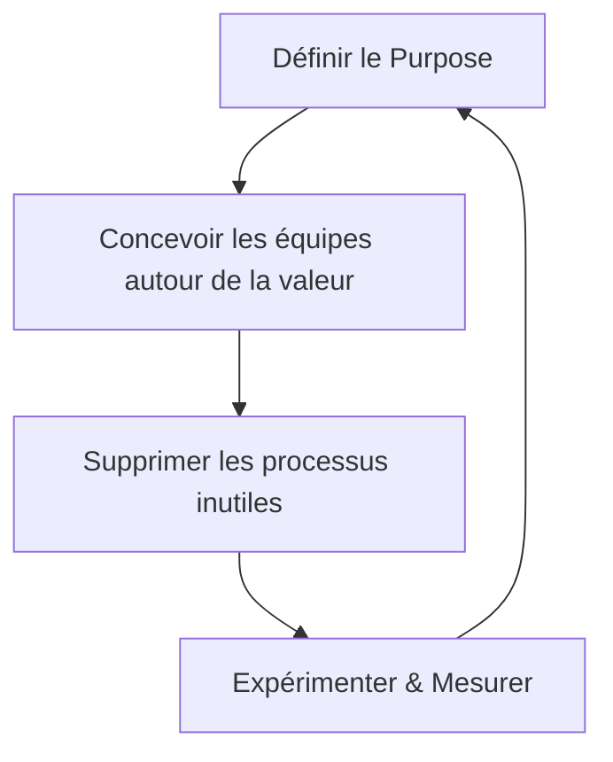

# 🚀 **unFIX : vous libère des méthodes (et redonne du sens à vos équipes)**

> *"Vos équipes en ont marre de :*
> - **Scrum** → *"On passe plus de temps en cérémonies qu’à coder."*
> - **SAFe** → *"On est noyés sous les dépendances et les PI Plannings."*
> - **LeSS** → *"Trop théorique, pas adapté à notre réalité."*
>
> *Le problème ?*
> **Vous avez adopté un framework agile...*
> *...pour vous retrouver avec **encore plus de rigidité**.*
>
> *unFIX, c’est l’anti-framework :*
> - **Pas de rôles imposés** (pas de Scrum Master, pas de PO "officiel").
> - **Pas de cérémonies obligatoires** (pas de daily, pas de sprint review si ça n’a pas de sens).
> - **Pas de 'bonnes pratiques' à suivre aveuglément**.
>
> *À la place, unFIX propose :*
> - **Un modèle pour designer vos équipes autour de la valeur** (pas des fonctions).
> - **Des outils pour clarifier le 'pourquoi' avant le 'comment'**.
> - **Une approche expérimentale** (*"Essayez, mesurez, ajustez"*).
>
> *Dans ce guide, on voit :*
> - **Pourquoi unFIX est différent** (comparaison avec Scrum, SAFe, LeSS).
> - **Comment l’appliquer concrètement** (avec des exemples IT, produit, services).
> - **Les pièges à éviter** (ex : *"On a viré tous les processus... et c’est le chaos"*).
> - **Un retour d’expérience** (inspiré du [Café du Produit #38 chez OCTO](https://blog.octo.com/compte-rendu-du-cafe-du-produit-38--unfix-ou-comment-redonner-du-sens-a-l%27organisation-de-vos-equipes-produit-sans-dogme-ni-recette)).
> - **Un plan en 4 étapes** pour démarrer avec unFIX.
>
> *Prêt à sortir du carcan des méthodes agiles industrielles ?*
> **C’est parti."**
> — **Coach Sticko**

---

## 🎯 **unFIX en 3 Principes Clés (Pourquoi Ça Marche)**

| **Principe**               | **Ce que ça veut dire**                                                                 | **Exemple concret**                                                                 |
|----------------------------|----------------------------------------------------------------------------------------|------------------------------------------------------------------------------------|
| **1. Purpose Over Process** | **Le "pourquoi" prime sur le "comment".** Pas de processus sans but clair.             | *"Notre équipe existe pour réduire le temps de livraison des commandes."* → **Pas de daily si ça n’aide pas ce but.** |
| **2. Team Design**         | **Les équipes sont conçues autour de la valeur** (pas des compétences).               | Une équipe *"Paiement"* avec devs, designers, data analysts → **Pas une équipe "Frontend" et une équipe "Backend".** |
| **3. Experiment & Adapt**  | **Tout est temporaire et ajustable.** Pas de "meilleure pratique" figée.               | *"On essaie les OKRs 3 mois, puis on voit si ça apporte de la valeur."*              |

**→ Résultat :** Des équipes **autonomes, alignées sur l’impact**, et **libérées des processus inutiles**.

---

## 🔍 **unFIX vs. Les Autres Frameworks (Pourquoi C’est Différent ?)**

| **Framework**  | **Approche**                                                                 | **Points forts**                          | **Limites**                                  | **Quand choisir unFIX ?**                          |
|----------------|-----------------------------------------------------------------------------|------------------------------------------|---------------------------------------------|----------------------------------------------------|
| **Scrum**      | Rôles fixes (PO, SM, Devs), sprints, cérémonies.                            | Simple à démarrer.                      | Rigide, beaucoup de réunions.              | Si vous voulez **sortir des cérémonies inutiles**. |
| **SAFe**       | Scaling avec PI Planning, ARTs, dépendances gérées.                        | Bonne pour les grosses orgs.             | Lourd, bureaucratique.                     | Si vous voulez **éviter la lourdeur**.            |
| **LeSS**       | Scrum à l’échelle, avec un seul PO pour plusieurs équipes.                 | Moins lourd que SAFe.                    | Difficile à adapter.                       | Si vous voulez **plus de flexibilité**.           |
| **Spotify**    | Squads, Tribes, Chapters.                                                   | Inspire l’autonomie.                     | Pas un framework (juste un modèle).        | Si vous voulez **un vrai cadre (sans copier Spotify)**. |
| **unFIX**      | **Pas de dogme.** Équipes conçues sur la valeur, expérimentation continue. | **Adaptable, léger, axé impact.**        | Moins de "recettes clés en main".          | **Si vous voulez une org agile SANS framework rigide.** |

**→ unFIX est fait pour vous si :**
✅ Vous en avez marre des **processus qui n’apportent pas de valeur**.
✅ Vous voulez **redonner du sens** à vos équipes (pas juste "faire de l’agile").
✅ Vous préférez **expérimenter et ajuster** plutôt que suivre un manuel.

---

## 🛠 **Comment Appliquer unFIX ? 4 Étapes Clés**

### **Étape 1 : Clarifiez le "Pourquoi" (Purpose)**
**Outil :** Le **"Purpose Canvas"** (inspiré d’unFIX).

| **Question**               | **Exemple de réponse**                                                                 |
|----------------------------|---------------------------------------------------------------------------------------|
| **Pourquoi cette équipe existe-t-elle ?** | *"Réduire le taux d’abandon de panier de 30% à 15% en 6 mois."*                     |
| **Quelle valeur pour le client ?** | *"Les clients finalisent leur achat sans frustration."*                              |
| **Quelle valeur pour l’entreprise ?** | *"+10% de revenus grâce à moins d’abandons."*                                        |
| **Comment on mesure le succès ?** | *"Taux d’abandon (Google Analytics), feedback clients (NPS)."*                       |

**Piège à éviter :**
- *"Notre purpose est 'd’être agile'."* → **❌ Trop vague.**
- *"Notre purpose est 'de livrer des features'."* → **❌ Pas orienté impact.**

**→ Un bon purpose répond à :**
1. **"Quel problème du client on résout ?"**
2. **"Comment on sait qu’on a réussi ?"**

---

### **Étape 2 : Concevez Vos Équipes Autour de la Valeur (Team Design)**
**Règle d’or :**
*"Une équipe = un flux de valeur complet.*
*Pas une compétence (ex : 'équipe frontend'),*
*mais un résultat (ex : 'équipe checkout')."*

**Exemple (E-commerce) :**
| **Équipe**          | **Membres**                          | **Purpose**                                  | **Métriques**               |
|---------------------|---------------------------------------|---------------------------------------------|------------------------------|
| **Checkout**        | 2 devs, 1 designer, 1 data analyst    | Réduire l’abandon de panier.               | Taux d’abandon, revenus.     |
| **Recommandations** | 1 dev, 1 ML engineer, 1 produit       | Augmenter le panier moyen.                 | Panier moyen, clics.         |
| **Livraison**       | 1 dev, 1 logistique, 1 support       | Réduire les délais de livraison.            | Temps de livraison, NPS.     |

**Piège à éviter :**
- **Créer des équipes "par techno"** (ex : *"Équipe React"*) → **❌ Pas orienté valeur.**
- **Avoir des équipes trop grosses** (>9 personnes) → **❌ Trop de dépendances internes.**

**→ Une bonne équipe unFIX :**
- **A un purpose clair.**
- **A toutes les compétences pour livrer de la valeur** (pas de dépendances externes).
- **Est assez petite pour être agile** (<9 personnes).

---

### **Étape 3 : Supprimez les Processus Inutiles (Experiment & Adapt)**
**Méthode :**
1. **Lister tous vos processus actuels** (ex : daily, sprint review, PI Planning...).
2. **Demander à l’équipe :** *"Lequel de ces processus nous aide vraiment à atteindre notre purpose ?"*
3. **Supprimer ou adapter** ceux qui n’apportent pas de valeur.

**Exemple :**
| **Processus**       | **Valeur ?** | **Décision**                          |
|---------------------|--------------|---------------------------------------|
| Daily stand-up      | ❌ Non        | Remplacé par un **async update** (Slack). |
| Sprint review       | ✅ Oui        | Gardé, mais **plus court et orienté impact**. |
| PI Planning (SAFe)  | ❌ Non        | Remplacé par des **objectifs trimestriels + check-ins mensuels**. |

**Piège à éviter :**
- **Tout supprimer d’un coup** → **❌ Risque de chaos.**
  → **Solution :** Supprimez **un processus à la fois**, mesurez l’impact, ajustez.
- **Gardé un processus "par habitude"** → **❌ "On a toujours fait comme ça."**
  → **Solution :** *"Si on arrêtait ce processus, quel serait l’impact ?"*

---

### **Étape 4 : Mesurez et Ajustez en Continu**
**Outil :** Le **"Health Check unFIX"** (à faire tous les 3 mois).

| **Critère**                | **Question**                                                                 | **Score (1-5)** | **Action**                          |
|----------------------------|-----------------------------------------------------------------------------|-----------------|-------------------------------------|
| **Alignement**             | *"Tout le monde comprend le purpose de l’équipe ?"*                       | 4               | Clarifier avec un atelier.         |
| **Autonomie**              | *"L’équipe peut prendre des décisions sans escalade ?"*                   | 3               | Former les managers au coaching.    |
| **Impact**                 | *"On voit l’impact de notre travail sur le client ?"*                     | 5               | -                                   |
| **Expérimentation**        | *"On ose essayer de nouvelles façons de travailler ?"*                    | 2               | Lancer un "innovation sprint".      |
| **Collaboration**          | *"On travaille bien avec les autres équipes ?"*                          | 4               | Organiser un workshop cross-team.   |

**→ Si un score < 3 :** **C’est un signal d’alerte.** Lancez une rétro pour comprendre pourquoi.

---

## 🚀 **Retour d’Expérience : unFIX chez OCTO (Inspiré du Café du Produit #38)**
*(Source : [Blog OCTO](https://blog.octo.com/compte-rendu-du-cafe-du-produit-38--unfix-ou-comment-redonner-du-sens-a-l%27organisation-de-vos-equipes-produit-sans-dogme-ni-recette))*

### **Contexte**
- **Problème :** *"On avait adopté SAFe, mais les équipes étaient noyées sous les dépendances et les processus.*
  *Les PI Plannings prenaient 2 jours, et personne ne voyait l’impact de son travail."*
- **Objectif :** *"Redonner de l’autonomie et du sens aux équipes, sans tout casser."*

### **Ce Qu’ils Ont Fait**
1. **Arrêt des PI Plannings** → Remplacés par des **objectifs trimestriels + check-ins mensuels**.
2. **Création d’équipes "purpose-driven"** (ex : *"Équipe Onboarding Client"* au lieu de *"Équipe Backend"*).
3. **Suppression des daily stand-ups** → Remplacés par des **updates asynchrones** (Slack + 1 sync court/semaine).
4. **Introduction d’un "Impact Review"** (tous les mois) :
   - *"Quelle valeur avons-nous apportée au client ce mois-ci ?"*
   - *"Quel processus nous a ralentis ?"*

### **Résultats**
✅ **Réduction des dépendances** (moins de blocages entre équipes).
✅ **Plus d’autonomie** (*"Les équipes osent prendre des décisions"*).
✅ **Meilleur alignement** (*"Tout le monde comprend l’impact de son travail"*).
⚠ **Défi restant :** *"Certains managers ont du mal à lâcher le contrôle."*

### **Leurs Conseils**
- *"Ne supprimez pas tout d’un coup. Commencez par **un processus** (ex : les daily)."*
- *"Clarifiez le **purpose** AVANT de changer la structure."*
- *"Mesurez l’impact culturel, pas juste la productivité."*

---

## ⚠ **Les 5 Pièges à Éviter avec unFIX**

| **Piège**                          | **Pourquoi c’est dangereux**                          | **Comment l’éviter**                                  |
|-------------------------------------|-------------------------------------------------------|-------------------------------------------------------|
| **1. "On vire tout et on improvise"** | Sans cadre, c’est le chaos.                          | **Gardez quelques règles de base** (ex : *"On se sync 1x/semaine max"*). |
| **2. Oublier le purpose**           | Sans "pourquoi", les équipes perdent le nord.        | **Affichez le purpose partout** (Slack, murs, réunions). |
| **3. Créer des équipes trop grosses** | Trop de dépendances internes = lenteur.               | **Limitez à 7-9 personnes max**.                     |
| **4. Ne pas mesurer l’impact**      | Sans feedback, on ne sait pas si ça marche.           | **Faites un "Health Check" tous les 3 mois**.         |
| **5. Imposer unFIX sans adhésion**  | Si les équipes ne veulent pas, ça ne marchera pas.   | **Commencez par une équipe pilote motivée**.          |

---

## 📌 **unFIX en 1 Image (À Garder Sous la Main)**

**→ Boucle vertueuse :**
1. **Purpose clair** → 2. **Équipes alignées** → 3. **Moins de processus** → 4. **Amélioration continue**.

---
**📌 PS : Le "Test des 3 Questions" pour Savoir si unFIX est Fait pour Vous**
1. **"Est-ce que vos équipes passent plus de temps*
   *à suivre des processus qu’à créer de la valeur ?"** → **Si oui, unFIX peut aider.**
2. **"Est-ce que vos équipes savent POURQUOI elles existent ?"** → **Si non, commencez par clarifier le purpose.**
3. **"Est-ce que vous osez supprimer un processus*
   *même s’il est 'standard' (ex : les daily) ?"** → **Si oui, vous êtes prêt pour unFIX.**

*"unFIX, ce n’est pas un framework de plus.*
**C’est une façon de repenser l’agile :**
- **Moins de dogme.**
- **Plus de sens.**
- **Moins de processus.*
- **Plus d’impact.*
*Et si on arrêtait de suivre les règles*
*pour commencer à en écrire*
*qui ont du sens*
*pour NOUS ?"*
— **Coach Sticko** 🚀✨