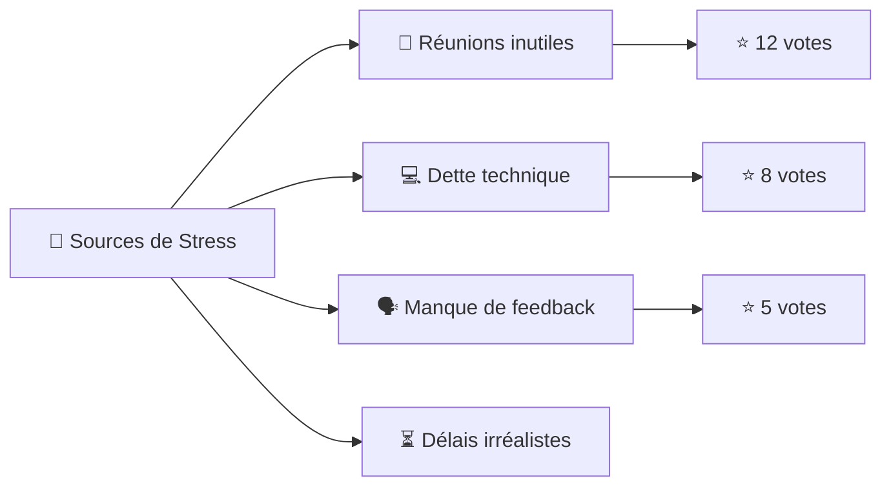

# **😰 Stress et Surcharge en Équipes Agile**
*Comment éviter que "l’urgence permanente" ne devienne la norme, et redonner de l’oxygène à vos équipes.*

**Tags** : `#stress` `#surcharge` `#burnout` `#équipe-agile` `#gestion-du-temps` `#bien-être` `#rétrospective` `#ateliers`

> *"En Agile, on court des sprints, pas un marathon sans fin. Si votre équipe ressemble à des zombies en réunion, c’est qu’il est temps de lever le pied."*
> — **Coach Sticko**

---

## **💡 Pitch**
**Problème** :
- **58%** des développeurs en Agile déclarent un niveau de stress élevé (enquête *Stack Overflow 2023*).
- **42%** des équipes Agile voient leur vélocité chuter après 6 sprints consécutifs sans pause (étude *Scrum Alliance*).
- Les signes avant-coureurs ? **Vélocité en dents de scie**, réunions où personne ne parle, ou au contraire, des débats houleux sur des détails.

**Solutions clés** :
1. **Repérer les symptômes** (burnout, présentéisme, cynisme).
2. **Appliquer des garde-fous** (WIP limits, timeboxing strict).
3. **Animer des ateliers dédiés** ("Boîte à stress", rétro énergie).
4. **Agir sur les causes racines** (dette technique, pression business, manque d’autonomie).

*Exemple concret* :
Une équipe dont la vélocité passe de **40 à 25 story points** en 3 sprints, avec des **daily scrums silencieuses** et des **retards répétés**, a probablement un problème de surcharge. Une **rétro énergie** révèle que 60% du stress vient de **dettes techniques non traitées** et de **réunions inutiles**.

---

## **📖 Définition & Origines**
### **Qu’est-ce que la surcharge en Agile ?**
Un déséquilibre entre :
- **La charge de travail** (tâches, réunions, interruptions).
- **Les ressources disponibles** (temps, énergie, compétences).
- **Le soutien organisationnel** (autonomie, reconnaissance, outils).

**Conséquences** :
➡️ **Burnout** (épuisement émotionnel + cynisme + inefficacité).
➡️ **Turnover** (coût moyen : **1,5x le salaire annuel** par départ, *Gallup*).
➡️ **Qualité en baisse** (plus de bugs, dette technique).

### **Origines du problème**
| Cause                          | Exemple Agile                                  | Impact                          |
|--------------------------------|-----------------------------------------------|---------------------------------|
| **Pressure cooker**            | "On doit livrer ces 10 stories **ce sprint** !" | Vélocité artificielle → burnout.|
| **Réunionites aiguës**         | 5 cérémonies + 3 ateliers par semaine.        | -20% de temps de focus.        |
| **Dette technique ignorée**    | "On verra plus tard..." (spoiler : jamais).   | +30% de temps perdu en rework. |
| **Manque d’autonomie**         | Micro-management du PO ou du manager.         | Démotivation, présentéisme.    |
| **Objectifs flous**            | "Faites de votre mieux" sans Definition of Done. | Stress lié à l’incertitude.    |

---

## **🚨 Signes d’Alerte (Burnout & Surcharge)**
### **1. Métriques Quantitatives**
| Indicateur               | Seuil d’alerte                          | Exemple                                  |
|--------------------------|-----------------------------------------|------------------------------------------|
| **Vélocité**             | Variation > **30%** sur 3 sprints.      | Sprint 1: 40 pts → Sprint 3: 28 pts.     |
| **Taux de bugs**          | +50% de bugs en production.             | 5 bugs/sprint → 12 bugs/sprint.          |
| **Absentéisme**          | > **10%** de jours d’absence/mois.      | 2 jours/mois/équipe de 5 → 5 jours.      |
| **Temps de réaction**    | Retards répétés sur les tâches simples.  | Une PR prend 3 jours au lieu de 1.      |
| **Turnover**             | 1 départ tous les 6 mois.               | Équipe de 7 → 2 départs en 1 an.         |

### **2. Signes Qualitatifs (Comportementaux)**
| Comportement             | Ce que ça cache                          | Que faire ?                             |
|--------------------------|-----------------------------------------|-----------------------------------------|
| **Silence en daily**     | Épuisement ou désengagement.            | Animer une **rétro énergie** (voir plus bas). |
| **Cynisme** ("À quoi bon ?") | Burnout (phase 2).                   | Atelier **"Boîte à stress"** pour identifier les causes. |
| **Présentéisme**         | "Je reste tard pour montrer que je bosse". | Limiter les heures sup, **celebrate small wins**. |
| **Conflits stupides**    | Stress → irritabilité.                  | **Time-out** + atelier de régulation émotionnelle. |
| **Oubli des bonnes pratiques** | "On saute les tests, on n’a pas le temps". | **WIP limits** strictes + rétro technique. |

---
## **⚡ Techniques Anti-Stress & Anti-Surcharge**
### **1. Gestion du Temps en Mode Itératif**
| Technique               | Comment l’appliquer en Agile ?                          | Exemple                                  |
|-------------------------|--------------------------------------------------------|------------------------------------------|
| **Timeboxing strict**   | Respecter **à la seconde** les durées des cérémonies.  | Daily = 15 min max, même si tout n’est pas dit. |
| **Limites de WIP**      | Max **2 tâches en cours par personne**.                | Tableau Kanban avec colonnes "En cours" limitées. |
| **Sprints courts**       | 1 semaine au lieu de 2/3.                               | Permet de **réajuster rapidement** la charge. |
| **Buffer time**          | Réserver **20% du sprint** pour l’imprévu.             | Ex: Sur 10 pts de capacité, n’en planifier que 8. |
| **No-Meeting Days**     | 1 jour/semaine **sans réunion**.                        | Ex: Mercredi = jour de focus technique.  |

**Outils** :
- **Toggl** (suivi du temps).
- **Miro** (template de WIP limits).
- **Scrum Poker** pour estimer **la charge mentale**, pas juste l’effort.

---
### **2. Atelier : "La Boîte à Stress"**
**Objectif** : Identifier et prioriser les sources de stress pour **agir sur les 20% qui causent 80% des problèmes**.

**Durée** : 45-60 min.
**Participants** : Équipe + Scrum Master/PO.

#### **Déroulement**
1. **Brainstorming individuel** (5 min) :
   - *"Qu’est-ce qui vous stresse le plus dans le travail actuel ?"* (1 post-it = 1 source de stress).
2. **Regroupement** (10 min) :
   - Coller les post-its sur un tableau et regrouper les thèmes (ex: "Réunions", "Dette technique").
3. **Vote dot** (5 min) :
   - Chaque participant a **3 dots** à répartir sur les groupes.
4. **Priorisation** (10 min) :
   - Classer les groupes par nombre de votes.
   - **Top 3** = sujets à traiter en **actions SMART**.
5. **Plan d’action** (15 min) :
   - *"Quelle est **une** action concrète pour réduire ce stress d’ici 2 semaines ?"*
   - Ex: *"Limiter les réunions à 30 min max"* → **PO s’engage à envoyer un ordre du jour clair 24h avant**.

**Template Miro** :


---
### **3. Rétrospective "Énergie"**
**Objectif** : Mesurer le **moral** et l’**énergie** de l’équipe, puis agir sur les **facteurs usants**.

**Durée** : 30-45 min.
**Format** : **4 quadrants** (sur un tableau ou Miro).

#### **Déroulement**
1. **Auto-évaluation** (5 min) :
   - Chaque membre place son **avatar** (ou post-it) sur le quadrant qui correspond à son état **cette itération** :
     ```
     😊 Haute énergie / Bon moral   | 😐 Basse énergie / Bon moral
     -------------------------------|-------------------------------
     😤 Haute énergie / Mauvais moral | 😴 Basse énergie / Mauvais moral
     ```
2. **Tour de table** (10 min) :
   - *"Pourquoi tu te situes ici ?"* (1 phrase max).
3. **Identification des patterns** (10 min) :
   - *"Quels sont les **2 facteurs** qui ont le plus impacté notre énergie ?"* (ex: "Délai serré pour la release", "Manque de pauses").
4. **Actions** (10 min) :
   - *"Quelle est **une chose** qu’on peut changer **dès le prochain sprint** ?"*
     - Ex: *"Ajouter une pause de 10 min entre les réunions"* ou *"Bloquer 1h/semaine pour réduire la dette technique"*.

**Exemple de résultat** :
| Quadrant               | Causes identifiées                          | Action proposée                          |
|------------------------|--------------------------------------------|------------------------------------------|
| 😤 Haute énergie / ❌ moral | Pressure du client, bugs en prod.         | Atelier "Boîte à stress" + rétro technique. |
| 😴 ❌ énergie / ❌ moral  | 3 sprints sans pause, dette technique.     | **Sprint de refacto** + jour sans réunion. |

---
## **🛡️ Solutions par Contexte**
### **1. Équipe en Burnout (Phase Critique)**
| Symptôme               | Solution Immédiate                          | Solution Structurelle                     |
|------------------------|--------------------------------------------|------------------------------------------|
| Vélocité en chute libre | **Annuler le sprint** → atelier de reset. | **Réévaluer les objectifs** avec le PO.  |
| Conflits fréquents      | **Médiation externe** (coach Agile).       | **Formation en communication non-violente**. |
| Absentéisme élevé      | **Entretiens individuels** (1:1).         | **Politique de télétravail flexible**.   |

**Exemple** :
Une équipe avec **50% d’absentéisme** et une vélocité divisée par 2 :
➡️ **Action 1** : Annuler le sprint en cours, organiser un **atelier "Reset"** (2h) pour :
   - Lister les **sources de frustration**.
   - **Prioriser 1 action** par personne pour la semaine suivante (ex: "Je prends 1h pour documenter mon code").
➡️ **Action 2** : Mettre en place un **système de "guardrails"** :
   - **WIP limit = 1 tâche par personne**.
   - **Pas de réunion après 16h**.

---
### **2. Nouvelle Équipe (Prévention)**
| Risque                  | Solution Préventive                        | Outils                                  |
|-------------------------|--------------------------------------------|-----------------------------------------|
| Surcharge dès le 1er sprint | **Capacité réduite de 30%** le 1er mois. | **Velocity range** (ex: 20-30 pts).    |
| Manque de cohésion      | **Atelier de team-building** (ex: "Marshmallow Challenge"). | **Retro "Safety Check"** (Google). |
| Flou sur les attentes   | **Definition of Done (DoD) claire**.        | **Confluence + validation en équipe**. |

**Exemple** :
Une équipe nouvellement formée :
➡️ **Sprint 0** :
   - **Atelier "Contrat d’équipe"** (règles de collaboration).
   - **DoD co-construite** (ex: "Tout le code est revu + tests unitaires").
➡️ **Sprint 1** :
   - **Capacité à 70%** (pour absorber l’apprentissage).
   - **Rétro "Énergie"** à la fin.

---
### **3. Équipe en Hypercroissance (Scale-Up)**
| Défis                   | Solutions                                   | Exemple                                  |
|-------------------------|---------------------------------------------|------------------------------------------|
| Trop de dépendances     | **Guildes transverses** (ex: guild "Frontend"). | 1h/semaine pour aligner les pratiques.   |
| Réunions à n’en plus finir | **Asynchronous updates** (ex: Loom + Slack). | Remplacer 2 réunions par des vidéos courtes. |
| Perte de sens           | **OKR visuels** + **impact mapping**.       | Tableau Miro avec "Pourquoi on fait ça ?". |

**Exemple** :
Une équipe qui passe de **5 à 15 personnes** :
➡️ **Problème** : Les daily scrums durent **45 min** et tout le monde parle en même temps.
➡️ **Solution** :
   - **Split en sous-équipes** (3 équipes de 5).
   - **Daily asynchrone** (vidéo Loom de 5 min max par équipe).
   - **1 sync par semaine** pour les dépendances.

---
## **✅ Checklist Anti-Surcharge**
### **Pour les Équipes**
- [ ] **Mesurer la vélocité** sur 3 sprints : une baisse de **>20%** = signal d’alerte.
- [ ] **Limiter le WIP** : max 2 tâches en cours par personne.
- [ ] **Bloquer du temps pour la dette technique** (ex: 1 story/sprint dédiée).
- [ ] **Faire une rétro "Énergie"** tous les 3 sprints.
- [ ] **Instaurer des "No-Meeting Days"** (ex: mercredi = jour de focus).
- [ ] **Célébrer les petites victoires** (ex: "On a réduit les bugs de 30% !").

### **Pour les Scrum Masters / Managers**
- [ ] **Observer les signes de burnout** (silence en daily, cynisme).
- [ ] **Protéger l’équipe des interruptions** (ex: "Non, ils ne peuvent pas ajouter cette story en cours de sprint").
- [ ] **Former à la gestion du temps** (ex: atelier Pomodoro pour les devs).
- [ ] **Escalader les problèmes structurels** (ex: dette technique bloquante).
- [ ] **Proposer des ressources** (ex: abonnement Headspace, coach bien-être).

---
> *"En Agile, on parle souvent de vélocité, mais la vraie performance, c’est une équipe qui tient la distance **sans s’épuiser**. Un sprint, c’est comme un marathon : si tu pars trop vite, tu t’effondres avant la ligne d’arrivée."*
> — **Coach Sticko** 🏃‍♂️💨