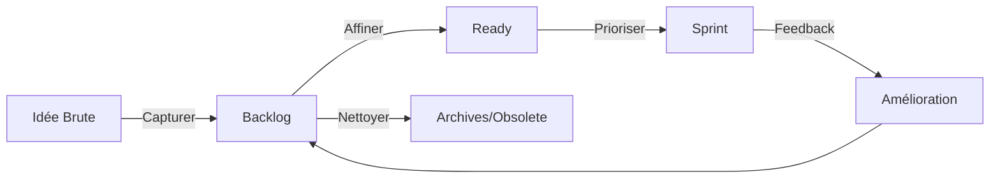

# 📋 **Product Backlog Management : transformer le chaos en clarté**

> *"Un Product Backlog mal géré, c'est comme une liste de courses écrite par 5 personnes différentes :*
> *Tu finis avec 3 paquets de pâtes,*
> *0 légumes,*
> *et une note mystérieuse qui dit 'ne pas oublier la chose'.*
>
> *Sauf que dans le backlog,*
> **la 'chose' coûte 3 sprints et personne ne sait pourquoi elle est là."*
> — **Coach Sticko**

---

## 🧩 **Les 3 Piliers d'un Backlog Sain**
Un bon Product Backlog repose sur :

| **Pilier**          | **Définition**                                                                 | **Signes de Bon Fonctionnement** 👍                          | **Symptômes de Dysfonctionnement** 👎                     |
|---------------------|------------------------------------------------------------------------------|------------------------------------------------------------|----------------------------------------------------------|
| **Clarté**          | Chaque item est compris par **toute l'équipe** (devs, PO, stakeholders).  | - Les devs estiment sans poser 100 questions.              | - "On verra bien ce que ça veut dire en cours de sprint". |
| **Priorisation**    | Les items sont **ordonnés par valeur/urgence**, pas par pression politique. | - Le top 10 est toujours à jour.                          | - "Ce ticket est prioritaire parce que le DG l'a dit".    |
| **Équilibre**       | Mix entre **valeur business**, **améliorations techniques** et **dette**.   | - 20% du backlog = améliorations non-fonctionnelles.      | - 100% features, 0% technique.                           |

---

## 🔄 **Le Cycle de Vie d'un Backlog (Ou Comment Éviter qu'il Devienne un Cimetière à Idées)**



### **1️⃣ Capturer les Idées**
**Où tout commence (et souvent, où tout dérape).**

✅ **Bonnes pratiques** :
- **1 seul point d'entrée** (ex : un canal Slack "#product-ideas", un tableau Trello).
- **Format minimal** : *"En tant que [qui], je veux [quoi] pour [pourquoi]."* (même si c'est light).
- **Pas de tri à ce stade** : tout est accepté, même les idées "farfelues".

❌ **Pièges** :
- **Le "Backlog Poubelle"** : Tout y atterrit sans filtrage → 500 items dont 80% inutiles.
- **Les idées "fantômes"** : "On en a parlé en réunion, mais personne ne l'a notée".

🛠 **Outils** :
- **Templates** :
  ```markdown
  **Idée** : [Titre court]
  **Porté par** : [Qui propose ?]
  **Contexte** : [1 phrase max]
  **Impact attendu** : [Qualitatif > quantitatif à ce stade]
  **Lien** : [Figma/Slack/email de référence]
  ```

---

### **2️⃣ Affiner le Backlog (Refinement)
**L'étape où les idées deviennent des user stories actionnables.**

📌 **Règle d'or** :
> *"Une user story est 'Ready' quand*
> **l'équipe de dev peut l'estimer sans poser de questions.**
> *Sinon, c'est du travail en cours pour le PO."*
> — **Coach Sticko**

✅ **Checklist "Ready"** :
- [ ] **Clarté** : "En tant que [rôle], je veux [fonctionnalité] pour [bénéfice]".
- [ ] **Critères d'acceptation** : Liste de conditions pour valider la story.
- [ ] **Dépendance** : Aucune dépendance externe bloquante (ou identifiée).
- [ ] **Taille** : Assez petite pour tenir dans un sprint (idéalement ≤ 5 jours de travail).
- [ ] **Valeur** : Le "pourquoi" est clair pour l'équipe.

💡 **Exemple de Bon Refinement** :
```markdown
**Titre** : Afficher les promotions en cours sur la homepage
**En tant que** : Visiteur du site
**Je veux** : Voir les promotions actives dès la homepage
**Pour** : Profiter des offres sans avoir à chercher
**Critères d'acceptation** :
- Les promos sont affichées dans un carousel en haut de page.
- Le carousel est responsive (mobile/desktop).
- Cliquer sur une promo redirige vers la page produit.
- Max 5 promos affichées (par ordre de priorité business).
**Dépendances** : Aucune (API promos déjà disponible).
**Notes** : Design figma : [lien]
```

❌ **Anti-Patterns** :
- **"On verra bien"** : Une story sans critères d'acceptation = une usine à bugs.
- **Les "épics caméléons"** : Un ticket qui change de sens à chaque refinement.
- **Le "PO bottleneck"** : Seul le PO peut clarifier les stories → goulet d'étranglement.

🛠 **Techniques d'Affinement** :
| **Technique**          | **Quand l'utiliser**                          | **Exemple**                                                                 |
|------------------------|-----------------------------------------------|-----------------------------------------------------------------------------|
| **Example Mapping**    | Pour décomposer une story complexe.          | *"Quels exemples concrets illustrent cette règle métier ?"*               |
| **Story Splitting**    | Quand une story est trop grosse.              | *"Peut-on livrer cette fonctionnalité en 3 étapes ?"*                      |
| **Impact Mapping**     | Pour aligner les stories sur un objectif.    | *"Quel comportement utilisateur veut-on changer ?"*                      |
| **Three Amigos**       | Réunir PO, Dev et Testeur pour clarifier.     | Session de 30 min pour affiner une story avant le sprint.                 |

---

### **3️⃣ Prioriser le Backlog
**L'art de dire "non" sans se faire détester.**

📊 **Méthodes de Priorisation** (avec avantages/inconvénients) :

| **Méthode**               | **Quand l'utiliser**                          | **Avantages**                              | **Inconvénients**                          | **Exemple**                                  |
|---------------------------|-----------------------------------------------|--------------------------------------------|--------------------------------------------|----------------------------------------------|
| **MoSCoW**                | Backlog simple, besoin de catégoriser vite.   | Simple, visuel.                           | Trop binaire (Must/Should).                | *"Cette story est un Must pour le MVP."*      |
| **RICE**                  | Priorisation data-driven.                     | Prend en compte l'impact et l'effort.      | Subjectif sur les scores.                 | *"Reach=100, Impact=3, Confidence=80%."*    |
| **Cost of Delay**         | Quand le temps est un facteur critique.      | Met l'accent sur l'urgence économique.     | Complexe à calculer.                       | *"Cette feature rapporte 5k€/semaine de retard."* |
| **Kano Model**            | Pour équilibrer satisfactions et basiques.    | Distingue les "delighters" des "must-have".| Nécessite une bonne connaissance utilisateur. | *"Le chatbot est un 'delighter', pas un must."* |
| **Theme Screening**       | Pour aligner avec la stratégie long terme.   | Lie les stories aux objectifs business.   | Peut être trop haut niveau.               | *"Ce trimestre, on focus sur la rétention."* |

💡 **Astuce de Coach Sticko** :
> *"La meilleure méthode de priorisation ?*
> **Celle que votre équipe comprend et utilise.**
>
> *J'ai vu des équipes gaspiller des semaines à débattre*
> *sur RICE vs. Cost of Delay...*
> *alors qu'elles n'avaient même pas clarifié leurs objectifs.*
>
> **Commencez simple** :
> 1. **Quels sont nos 3 objectifs ce trimestre ?**
> 2. **Quelles stories y contribuent le plus ?**
> 3. **Est-ce que c'est réalisable maintenant ?**
>
> *Le reste, c'est du théâtre."*
> — **Coach Sticko**

---

### **4️⃣ Nettoyer le Backlog
**La partie la plus négligée (et la plus importante).**

⚠️ **Pourquoi nettoyer ?**
- Un backlog enflé = **stress** pour l'équipe ("On n'y arrivera jamais").
- Des stories obsolètes = **perte de temps** en refinement.
- **Manque de visibilité** sur ce qui compte vraiment.

✅ **Rituel de Nettoyage** (à faire tous les 2-3 sprints) :
1. **Archiver** :
   - Les stories non priorisées depuis > 6 mois.
   - Les idées sans porteur clair.
2. **Fusionner** :
   - Les doublons (ex : 3 stories sur "améliorer le checkout").
3. **Réévaluer** :
   - *"Cette story était prioritaire il y a 3 mois. Est-ce encore le cas ?"*
4. **Documenter** :
   - *"Pourquoi on a archivé cette idée ?"* (pour éviter les "Mais on en avait parlé !").

💡 **Exemple de Nettoyage** :
| **Action**          | **Critère**                                  | **Exemple**                                  |
|---------------------|---------------------------------------------|---------------------------------------------|
| **Archiver**        | Pas touchée depuis 6 mois + pas de porteur. | *"Intégration avec le CRM X"* (abandonné).  |
| **Fusionner**       | 2 stories qui traitent du même sujet.      | *"Améliorer la recherche"* + *"Ajouter des filtres"* → 1 story. |
| **Réévaluer**       | Priorité changée (ex : nouveau concurrent).| *"Refonte du dashboard"* → descend en P3.  |

---

## 🚨 **Les 7 Pièges qui Pourrissent un Backlog (Et Comment les Éviter)**

| **Piège**                     | **Symptômes**                              | **Solution**                                                                 |
|-------------------------------|--------------------------------------------|------------------------------------------------------------------------------|
| **Le Backlog "Poubelle"**     | 500+ items, dont 80% inutiles.             | **Rituel de nettoyage mensuel** + règle : *"1 nouvelle idée = 1 ancienne archivée"*. |
| **Les Stories "Zombies"**     | Des tickets qui reviennent sans cesse.      | **Soit on les fait, soit on les enterre.** *"Si c'est important, priorisez-le. Sinon, archivez."* |
| **Le Syndrome du "Tout est Urgent"** | Tous les tickets sont P1.          | **Limiter à 10% du backlog en "Must Have"**. Le reste = "Should/Could".     |
| **Le PO "Bottleneck"**         | Seul le PO peut clarifier les stories.     | **Former l'équipe au refinement** + désigner un "proxy PO" dans l'équipe dev. |
| **Les Stories "Trop Grosses"** | Des épics de 3 sprints.                   | **Story Splitting** : *"Comment livrer 20% de la valeur en 1 sprint ?"*     |
| **L'Alignement Fantôme**      | Le backlog ne reflète pas la stratégie.     | **Lier chaque story à un objectif OKR** (ex : *"Cette story contribue à +10% de rétention"*). |
| **Le Backlog "Invisible"**    | Personne ne sait ce qu'il y a dedans.      | **Rendre le backlog visible** (tableau physique, outil partagé) + **revue hebdo de 15 min**. |

---

## 🛠 **Outils pour Gérer son Backlog (Sans Perdre son Âme)**

| **Outil**            | **Pourquoi ?**                              | **Bonnes Pratiques**                                  | **Pièges**                          |
|----------------------|--------------------------------------------|-------------------------------------------------------|-------------------------------------|
| **Jira**             | Standard pour les équipes tech.            | - Utiliser les **épics** pour regrouper.              | - Trop complexe pour les non-tech. |
| **Trello**           | Simple et visuel.                          | - Une colonne "Icebox" pour les idées brutes.        | - Manque de fonctionnalités avancées. |
| **Miro + Post-its**  | Pour les ateliers de refinement.           | - **Colorer par thème** (ex : bleu=technique).         | - Difficile à maintenir à jour.     |
| **Productboard**     | Pour aligner stakeholders et backlog.      | - **Lier les stories aux objectifs stratégiques**.   | - Cher pour les petites équipes.   |
| **Notion**           | Pour documenter le "pourquoi".             | - **Une page par story** avec contexte + décisions.   | - Peut devenir un fouillis.        |

💡 **Template Notion pour un Backlog** :
```markdown
### [Nom de la Story]
**Statut** : [Idée / À affiner / Ready / En cours / Terminé]
**Porté par** : [PO/Stakeholder]
**Objectif** : [Lien vers l'objectif stratégique]
**Valeur** : [Ex : "Réduire les abandons de panier de 10%"]
**Critères d'acceptation** :
- [ ] ...
- [ ] ...
**Dépendances** : [Ex : "API de paiement V2"]
**Risques** : [Ex : "Intégration complexe avec le legacy"]
**Historique** :
- [2023-10-15] : Ajoutée suite à feedback client X.
- [2023-11-02] : Refinement avec l'équipe dev.
```

---

## 🎯 **Exemple Concret : Backlog d'une Équipe SaaS (Before/After)**

### ❌ **Before : Le Chaos**
- **500+ items** (dont 200 "à trier").
- **Stories comme** : *"Améliorer l'UX"* (trop vague).
- **Priorisation** : *"Le commercial a dit que c'était urgent"*.
- **Refinement** : 1h de réunion où le PO parle seul.

### ✅ **After : La Clarté**
- **Backlog** : 80 items max, dont 20 "Ready".
- **Stories** :
  ```markdown
  **Titre** : Ajouter un bouton "Recommander à un ami"
  **Valeur** : +5% de références (objectif : acquisition organique)
  **Critères** :
  - Bouton visible sur la page de confirmation de commande.
  - Lien de parrainage personnalisé.
  - Email automatique au parrain/filletule.
  ```
- **Priorisation** : Méthode **RICE** (Reach=100, Impact=2, Confidence=90%, Effort=3).
- **Refinement** : Atelier **Three Amigos** (PO + 1 dev + 1 testeur) de 30 min par story.

📈 **Résultat** :
- **Vélocité stable** (moins de temps perdu à clarifier).
- **Moins de stress** ("On sait ce qu'on doit faire").
- **Meilleur alignement** avec les objectifs business.

---

## 💬 **Retours du Terrain (REX)**

### ✅ **Ça a Marché !**
- *"On a divisé notre backlog par 5 en 1 mois en appliquant la règle : **'1 nouvelle idée = 1 ancienne archivée'**. Résultat : plus de focus, moins de stress."* — **PO en e-commerce**
- *"Le **Story Splitting** a sauvé notre sprint. Au lieu d'une grosse feature en 3 sprints, on a livré 3 petites améliorations en 1 sprint. **Le client était ravi !**"* — **Scrum Master en fintech**

### ❌ **Ça a Floppé (et Pourquoi)**
- *"On a essayé **Cost of Delay**, mais on a passé 2 semaines à débattre des chiffres. **Trop complexe pour nous.** On est revenus à MoSCoW."* — **Startup en hypercroissance**
- *"Notre backlog était un **cimetière à idées** : 300 tickets, dont 200 jamais priorisés. **On a tout archivé et recommencé à zéro.**"* — **Agile Coach en entreprise traditionnelle**

---

## 🎭 **Le Mot de la Fin (Par Coach Sticko)**

> *"Gérer un Product Backlog, c'est comme jardiner :*
> - **Tu arraches les mauvaises herbes** (les idées obsolètes).
> - **Tu arroses ce qui pousse** (les stories alignées avec la stratégie).
> - **Tu tailles régulièrement** (le refinement).
> - **Et parfois, tu laisses pousser des trucs bizarres** (les idées folles qui deviennent des innovations).
>
> *Le piège ?*
> **Vouloir tout garder.**
> *Par peur de rater une opportunité,*
> *par pression des stakeholders,*
> *ou juste par procrastination.*
>
> *Mais un backlog, ce n'est pas un musée.*
> **C'est un outil vivant.**
>
> *Alors aujourd'hui, fais une chose :*
> **Archive 10 stories.**
> *Même si 'on ne sait jamais, ça pourrait servir'.*
> *Parce que spoiler alert :*
> **90% du temps, ça ne sert pas.**
>
> *Et les 10% restants ?*
> **Ils reviendront.**
> *Toujours.*
>
> *Maintenant, à toi de jouer :*
> **Quelle est la première story que tu vas archiver ?"*
> — **Coach Sticko** 🌱✂️

---
**📌 PS : Un Exercice pour Cette Semaine**
**Le "Backlog Diet"** :
1. **Triez** votre backlog en 4 catégories :
   - 🔥 **Top 10** (à faire dans les 3 prochains sprints).
   - 📅 **À planifier** (prochains 3-6 mois).
   - ❓ **À clarifier** (besoin de plus d'infos).
   - 🗑️ **À archiver** (pas touchées depuis 6 mois).
2. **Archivez** tout ce qui est dans 🗑️ **sans regret**.
3. **Partagez** le nouveau backlog avec l'équipe et célébrez la simplification !

*"Un backlog propre,*
*c'est comme un bureau rangé :*
**Ça ne résout pas tous tes problèmes,**
*mais ça te donne l'espace mental*
*pour les affronter."*
— **Coach Sticko** 🧹📋