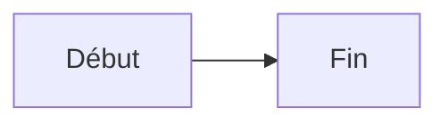
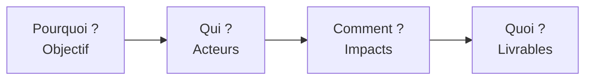
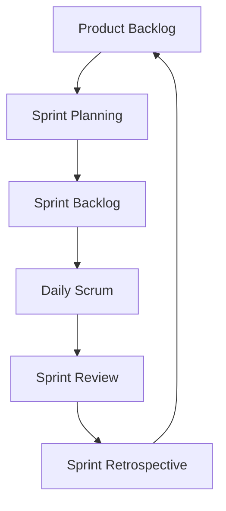
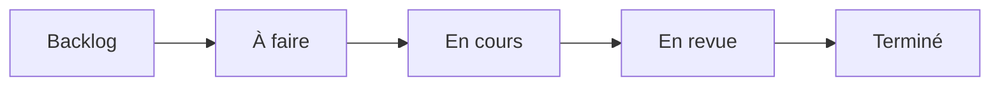
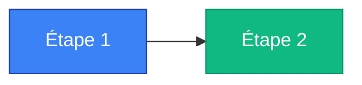
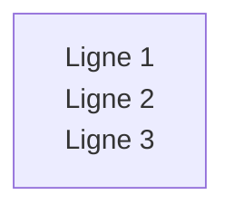
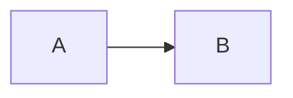

# 🚀 Guide Rapide Mermaid - Pour les Contributeurs

## Comment ajouter un diagramme Mermaid dans un article ?

### 1. Syntaxe de Base

Dans votre fichier Markdown (`.md`), utilisez cette syntaxe :

````markdown

````

**Important** : 
- ✅ Utilisez bien ` ```mermaid ` (avec le mot-clé `mermaid`)
- ❌ Ne pas utiliser juste ` ``` ` sans le mot-clé

### 2. Exemples Courants pour l'Agilité

#### Impact Mapping

````markdown

````

#### Cycle Scrum

````markdown

````

#### Workflow Kanban

````markdown

````

### 3. Ajouter des Couleurs

````markdown

````

**Palette de couleurs recommandée** :
- Bleu : `#3b82f6` (primaire)
- Vert : `#10b981` (succès)
- Orange : `#f59e0b` (attention)
- Rouge : `#ef4444` (erreur)
- Violet : `#8b5cf6` (info)
- Rose : `#ec4899` (spécial)

### 4. Sauts de Ligne dans les Nœuds

Utilisez `\n` pour créer des sauts de ligne :

````markdown

````

### 5. Tester Votre Diagramme

Avant de commiter, testez votre diagramme sur :
- **Éditeur en ligne** : https://mermaid.live/
- **Fichier de test local** : `tests/test-mermaid-parser.html`

### 6. Checklist Avant Commit

- [ ] Le bloc commence bien par ` ```mermaid `
- [ ] Le diagramme s'affiche correctement sur mermaid.live
- [ ] Les couleurs sont cohérentes avec la charte graphique
- [ ] Les labels sont lisibles (pas trop longs)
- [ ] Le diagramme est simple et compréhensible

### 7. Erreurs Courantes

#### ❌ Erreur : Bloc sans mot-clé

```markdown
```
graph LR
    A --> B
```
```

#### ✅ Correct

````markdown

````

#### ❌ Erreur : Syntaxe Mermaid invalide

````markdown
```mermaid
graph LR
    A[Début] -> B[Fin]  ❌ Mauvaise flèche
```
````

#### ✅ Correct

````markdown
```mermaid
graph LR
    A[Début] --> B[Fin]  ✅ Bonne flèche
```
````

### 8. Ressources

- **Documentation complète** : [docs/MERMAID-INTEGRATION.md](MERMAID-INTEGRATION.md)
- **Éditeur en ligne** : https://mermaid.live/
- **Documentation officielle** : https://mermaid.js.org/

---

**Besoin d'aide ?** Consultez les exemples dans `content/animation-facilitation/impact-mapping.md`
