# 📊 Intégration Mermaid.js - Guide d'Utilisation

## Vue d'ensemble

Le site supporte maintenant **Mermaid.js** pour créer des diagrammes directement dans les fichiers Markdown. Mermaid permet de créer des diagrammes de flux, des graphiques, des diagrammes de séquence, et bien plus encore, en utilisant une syntaxe simple basée sur du texte.

## 🚀 Utilisation de Base

### Syntaxe dans les fichiers Markdown

Pour créer un diagramme Mermaid, utilisez un bloc de code avec le langage `mermaid` :

````markdown
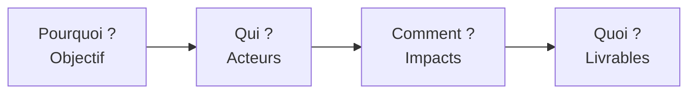
````

### Résultat

Le diagramme sera automatiquement rendu lors de l'affichage de la page.

## 📐 Types de Diagrammes Supportés

### 1. Diagrammes de Flux (Flowchart)

#### Orientation Horizontale (LR = Left to Right)
````markdown
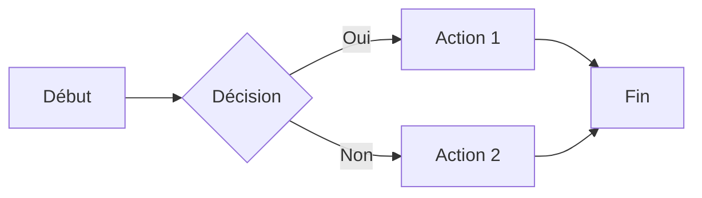
````

#### Orientation Verticale (TD = Top Down)
````markdown
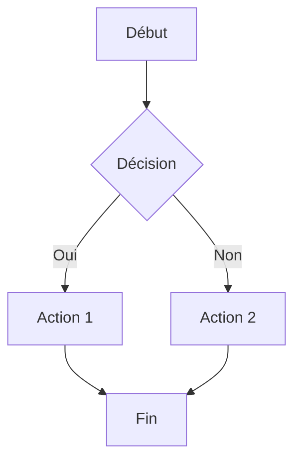
````

### 2. Diagrammes de Séquence

````markdown
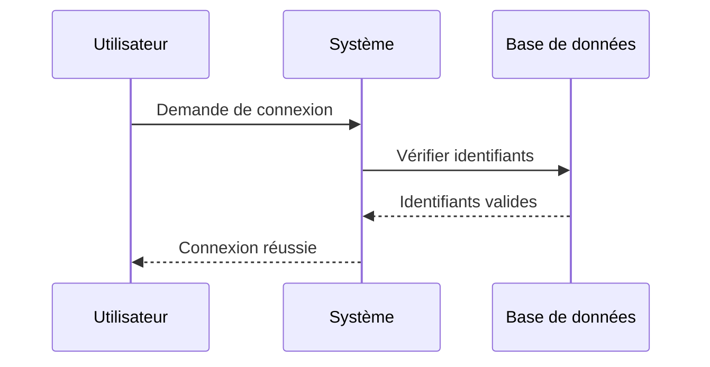
````

### 3. Diagrammes de Classes

````markdown
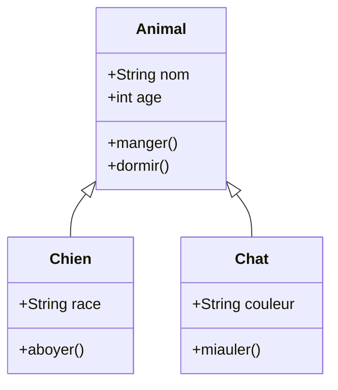
````

### 4. Diagrammes d'État

````markdown
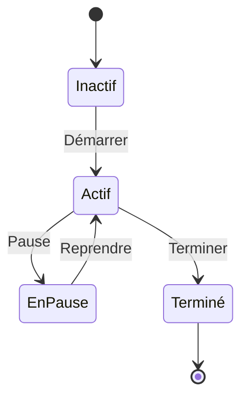
````

### 5. Diagrammes de Gantt

````markdown
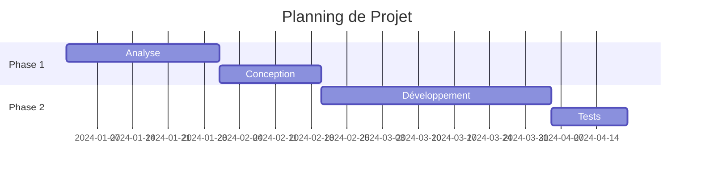
````

### 6. Diagrammes Circulaires (Pie Chart)

````markdown
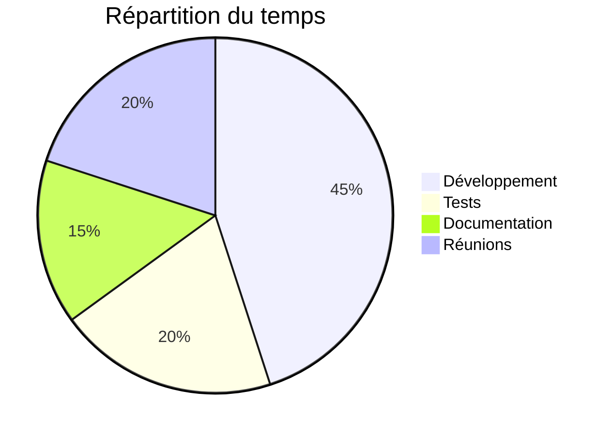
````

### 7. Diagrammes de Relations Entités (ERD)

````markdown
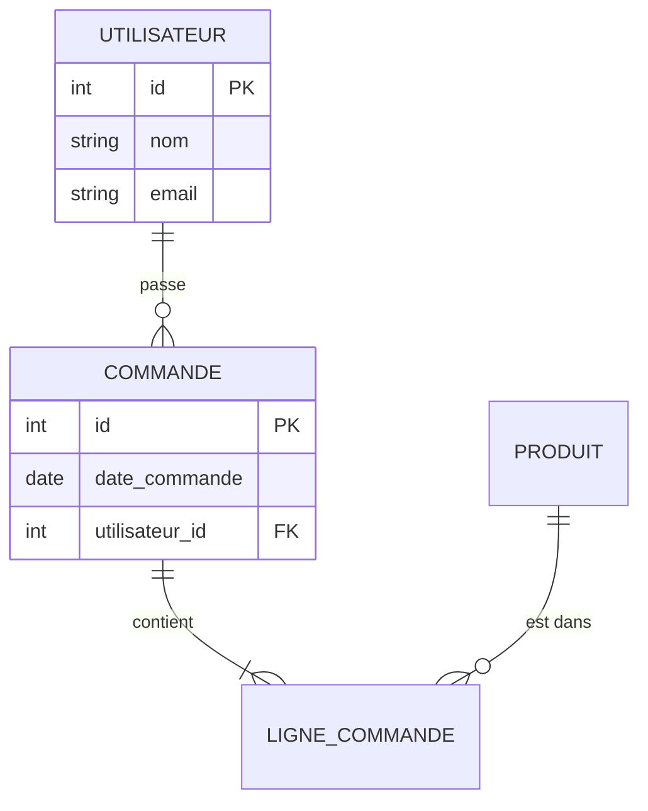
````

### 8. User Journey (Parcours Utilisateur)

````markdown
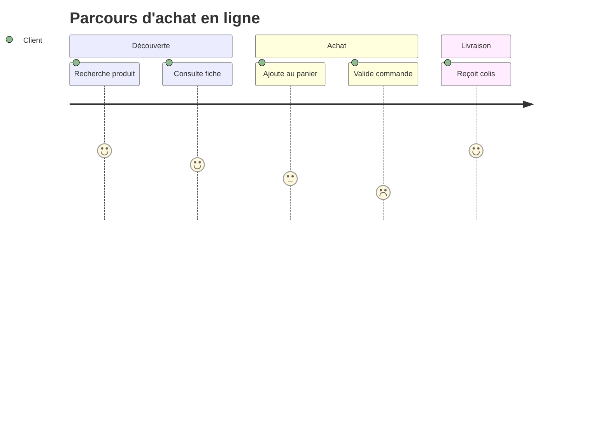
````

## 🎨 Personnalisation des Styles

### Formes de Nœuds

````markdown
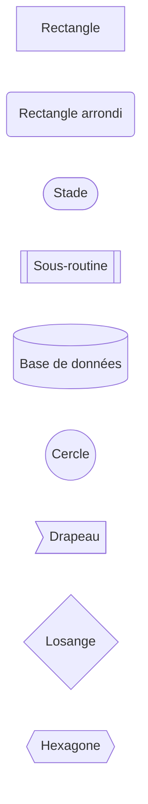
````

### Types de Flèches

````markdown
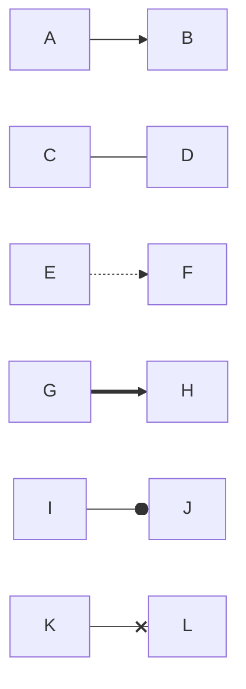
````

### Texte sur les Flèches

````markdown
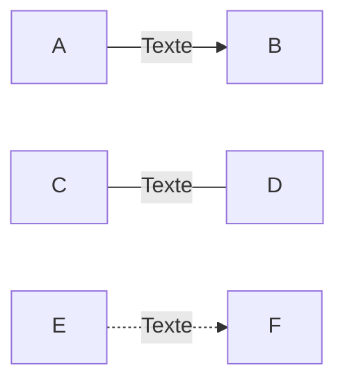
````

### Sauts de Ligne dans les Nœuds

Utilisez `\n` pour créer des sauts de ligne :

````markdown
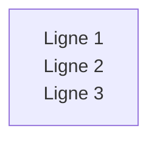
````

## 🎯 Exemples Pratiques pour l'Agilité

### Impact Mapping

````markdown
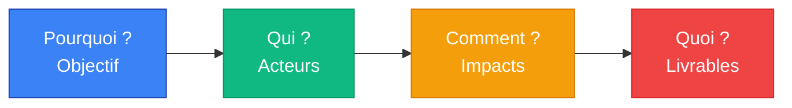
````

### Cycle Scrum

````markdown
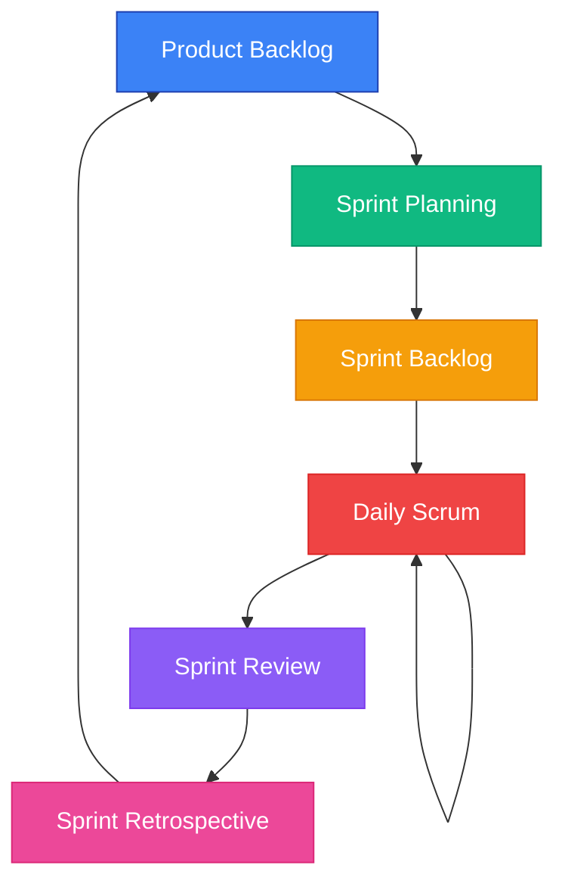
````

### Flux de Travail Kanban

````markdown
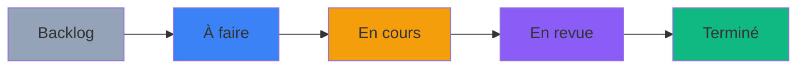
````

### Diagramme de Décision

````markdown
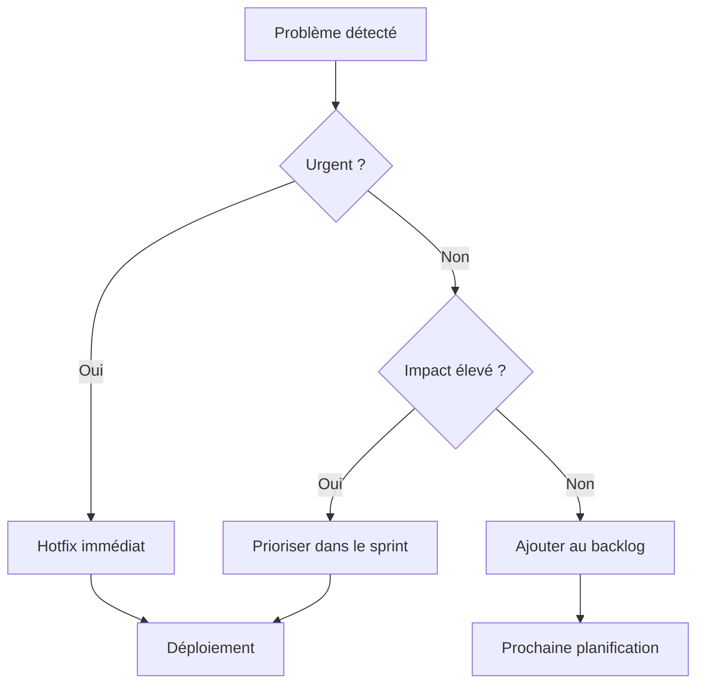
````

## 🔧 Configuration Technique

### Initialisation Automatique

Le système initialise automatiquement Mermaid lors du chargement du contenu Markdown :

```javascript
// Dans markdown-parser.js
function initMermaid() {
  if (typeof mermaid !== 'undefined') {
    mermaid.initialize({
      startOnLoad: true,
      theme: document.documentElement.getAttribute('data-theme') === 'dark' ? 'dark' : 'default',
      securityLevel: 'loose',
      fontFamily: 'inherit',
      flowchart: {
        useMaxWidth: true,
        htmlLabels: true,
        curve: 'basis'
      }
    });
  }
}
```

### Configuration de Marked.js

Pour que les blocs Mermaid soient correctement détectés, `marked.js` utilise un renderer personnalisé :

```javascript
// Dans content.html
const renderer = new marked.Renderer();
const originalCodeRenderer = renderer.code.bind(renderer);

renderer.code = function(code, language) {
    if (language === 'mermaid') {
        return `<div class="mermaid">${code}</div>`;
    }
    return originalCodeRenderer(code, language);
};

// Utiliser marked avec le renderer
html = marked.parse(markdown, { renderer });
```

Cette configuration permet de transformer automatiquement les blocs ` ```mermaid ` en `<div class="mermaid">` qui seront ensuite rendus par Mermaid.js.

### Adaptation au Thème

Les diagrammes s'adaptent automatiquement au thème clair/sombre du site. Lors du changement de thème, utilisez :

```javascript
refreshMermaid(); // Recharge tous les diagrammes avec le nouveau thème
```

### Styles CSS

Les diagrammes sont stylisés via `assets/css/markdown.css` :

```css
.markdown-content .mermaid {
  background: var(--bg-secondary);
  padding: var(--space-lg);
  border-radius: var(--radius-md);
  margin: var(--space-md) 0;
  border: 1px solid var(--border-default);
  overflow-x: auto;
  text-align: center;
}
```

## 📚 Ressources

- **Documentation officielle Mermaid** : https://mermaid.js.org/
- **Éditeur en ligne** : https://mermaid.live/
- **Exemples** : https://mermaid.js.org/ecosystem/integrations.html

## ⚠️ Limitations et Bonnes Pratiques

### Limitations

1. **Complexité** : Évitez les diagrammes trop complexes (> 50 nœuds)
2. **Performance** : Les diagrammes très larges peuvent ralentir le rendu
3. **Mobile** : Certains diagrammes larges nécessitent un scroll horizontal

### Bonnes Pratiques

1. **Simplicité** : Privilégiez des diagrammes simples et lisibles
2. **Sauts de ligne** : Utilisez `\n` pour améliorer la lisibilité des labels
3. **Couleurs** : Utilisez les styles pour différencier les éléments importants
4. **Test** : Testez vos diagrammes sur https://mermaid.live/ avant de les intégrer
5. **Accessibilité** : Ajoutez toujours une description textuelle alternative

## 🐛 Dépannage

### Le diagramme ne s'affiche pas

1. Vérifiez la syntaxe sur https://mermaid.live/
2. Assurez-vous que le bloc commence par ` ```mermaid `
3. Vérifiez la console du navigateur pour les erreurs
4. Rechargez la page (Ctrl+F5)

### Le diagramme est tronqué

1. Ajoutez `overflow-x: auto` au conteneur
2. Réduisez la complexité du diagramme
3. Utilisez l'orientation verticale (TD) au lieu d'horizontale (LR)

### Les couleurs ne s'affichent pas

1. Vérifiez que les styles sont bien appliqués
2. Utilisez le format hexadécimal pour les couleurs : `#3b82f6`
3. Testez avec le thème par défaut

---

**Créé avec ❤️ pour Coach Agile Toolkit**  
*Version 1.0.0 - Janvier 2025*
