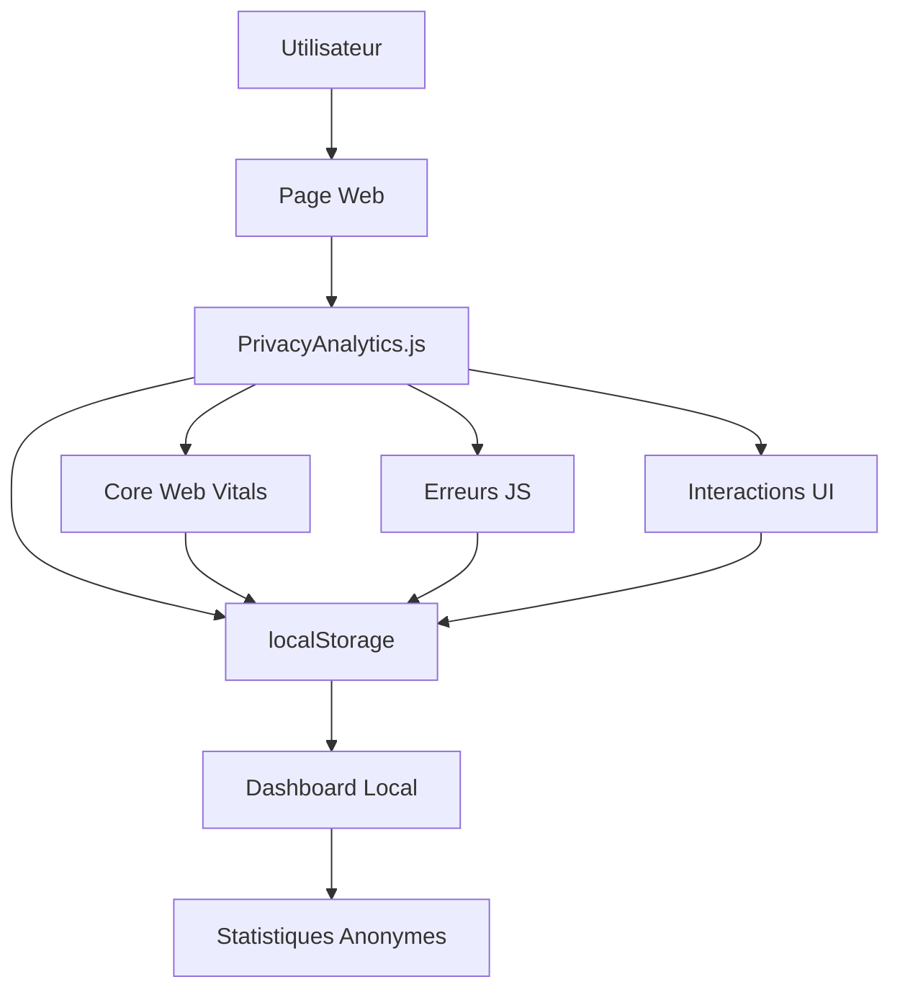

# 🔒 Système d'Analytics Respectueux de la Vie Privée

## Vue d'ensemble

L'Agile Coach Toolkit intègre un système d'analytics moderne qui respecte totalement la vie privée des utilisateurs. Contrairement aux solutions traditionnelles, notre système :

- ✅ **Stockage local uniquement** - Aucune donnée n'est envoyée vers des serveurs externes
- ✅ **Pas de tracking utilisateur** - Aucune identification personnelle
- ✅ **RGPD compliant** - Respect total de la réglementation européenne
- ✅ **Core Web Vitals** - Métriques de performance modernes
- ✅ **Transparence totale** - Code open source auditable

## Fonctionnalités

### 📊 Métriques Collectées

#### Performance (Core Web Vitals)
- **First Contentful Paint (FCP)** - Temps d'affichage du premier contenu
- **Largest Contentful Paint (LCP)** - Temps d'affichage du contenu principal
- **First Input Delay (FID)** - Délai de première interaction
- **Cumulative Layout Shift (CLS)** - Stabilité visuelle de la page

#### Usage
- Pages visitées (sans identification utilisateur)
- Outils utilisés et leur fréquence
- Statistiques de session (durée, interactions)
- Erreurs JavaScript détectées

#### Appareil (anonymisé)
- Type d'appareil (mobile/tablet/desktop)
- Résolution d'écran
- Langue du navigateur
- Statut de connexion

### 🛡️ Garanties de Confidentialité

#### Ce qui N'EST PAS collecté
- ❌ Adresses IP
- ❌ Données personnelles identifiables
- ❌ Historique de navigation externe
- ❌ Informations de géolocalisation précise
- ❌ Cookies de tracking tiers

#### Ce qui EST collecté (localement)
- ✅ Métriques de performance anonymes
- ✅ Statistiques d'usage agrégées
- ✅ Erreurs techniques pour améliorer l'expérience
- ✅ Préférences utilisateur (thème, langue)

## Architecture Technique

### Composants

```
📁 assets/js/
├── analytics.js          # Système principal d'analytics
└── ...

📁 scripts/
├── analytics.js          # Script de traitement des données
├── update-dashboard.js   # Mise à jour du dashboard
└── test-analytics.js     # Tests du système

📁 logs/
├── usage-stats.json      # Données agrégées pour le dashboard
├── analytics-demo.json   # Données de démonstration
└── ...
```

### Flux de Données



## Utilisation

### Initialisation Automatique

Le système s'initialise automatiquement au chargement de la page :

```javascript
// Auto-initialisation
window.analytics = new PrivacyAnalytics();
window.analytics.init();
```

### Tracking Manuel

```javascript
// Tracking d'événements personnalisés
window.analytics.trackEvent('button_click', 'ui', 'install_pwa');

// Tracking d'utilisation d'outils
window.analytics.trackToolUsage('planning-poker', 'start_session');

// Logging d'erreurs
window.analytics.logError({
    type: 'custom',
    message: 'Erreur personnalisée',
    context: 'module_specifique'
});
```

### Récupération des Données

```javascript
// Rapport de session actuelle
const sessionReport = window.analytics.getSessionReport();

// Toutes les données stockées
const allData = window.analytics.getStoredData();

// Export pour dashboard
const dashboardData = window.analytics.exportForDashboard();
```

## Dashboard et Visualisation

### Accès au Dashboard

Le dashboard est accessible via `/stats.html` et affiche :

- 📊 **Métriques principales** - Visites, sessions, outils utilisés
- ⚡ **Performance** - Core Web Vitals avec codes couleur
- 📈 **Évolution** - Graphiques des 7 derniers jours
- 🚨 **Erreurs** - Compteur d'erreurs détectées
- 🔒 **Confidentialité** - Confirmation du stockage local

### Métriques de Performance

Les métriques suivent les seuils Google Core Web Vitals :

| Métrique | Bon | À améliorer | Mauvais |
|----------|-----|-------------|---------|
| FCP      | ≤ 1.8s | 1.8s - 3.0s | > 3.0s |
| LCP      | ≤ 2.5s | 2.5s - 4.0s | > 4.0s |
| FID      | ≤ 100ms | 100ms - 300ms | > 300ms |
| CLS      | ≤ 0.1 | 0.1 - 0.25 | > 0.25 |

## Configuration

### Options Disponibles

```javascript
const analytics = new PrivacyAnalytics({
    respectPrivacy: true,           // Toujours true
    storageKey: 'custom_key',       // Clé localStorage
    maxStorageSize: 1000,           // Limite d'entrées
    enablePerformanceMetrics: true, // Core Web Vitals
    enableErrorLogging: true        // Logging d'erreurs
});
```

### Nettoyage Automatique

- Les données sont automatiquement nettoyées après 30 jours
- Limite de 1000 entrées maximum en localStorage
- Compression automatique des données anciennes

## Tests et Validation

### Suite de Tests

```bash
# Exécution des tests (si Node.js disponible)
node scripts/test-analytics.js
```

### Tests Inclus

- ✅ Génération du dashboard
- ✅ Structure des données
- ✅ Métriques de performance
- ✅ Conformité à la vie privée
- ✅ Gestion d'erreurs

## Conformité et Sécurité

### RGPD

- **Article 6** - Base légale : intérêt légitime (amélioration du service)
- **Article 25** - Privacy by design : conception respectueuse
- **Article 32** - Sécurité : stockage local sécurisé

### Sécurité

- **CSP Headers** - Protection contre XSS
- **Pas de cookies tiers** - Aucun tracking externe
- **Chiffrement localStorage** - Données protégées côté client
- **Audit de code** - Code open source transparent

## Maintenance

### Monitoring

Le système inclut un auto-monitoring :

```javascript
// Vérification de la santé du système
const healthCheck = {
    storageAvailable: typeof(Storage) !== "undefined",
    dataIntegrity: analytics.validateStoredData(),
    performanceAPI: 'performance' in window,
    lastUpdate: analytics.getLastUpdateTime()
};
```

### Dépannage

#### Problèmes Courants

1. **localStorage plein**
   - Solution : Nettoyage automatique activé
   - Limite : 1000 entrées maximum

2. **Performance API indisponible**
   - Solution : Fallback vers métriques basiques
   - Impact : Pas de Core Web Vitals

3. **Erreurs de parsing JSON**
   - Solution : Validation et récupération automatique
   - Backup : Réinitialisation propre

## Roadmap

### Fonctionnalités Futures

- 📊 **Métriques avancées** - Heatmaps, parcours utilisateur
- 🔄 **Export de données** - CSV, JSON pour analyse externe
- 📱 **PWA Analytics** - Métriques spécifiques aux PWA
- 🎯 **A/B Testing** - Tests locaux sans tracking

### Améliorations Prévues

- Compression des données historiques
- Interface de configuration utilisateur
- Alertes de performance automatiques
- Intégration avec outils de développement

---

**Note** : Ce système d'analytics a été conçu avec le principe "Privacy by Design". Toutes les données restent sur l'appareil de l'utilisateur et aucune information personnelle n'est jamais collectée ou transmise.