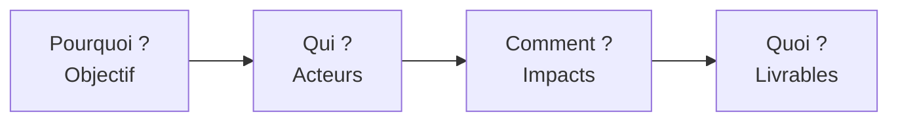
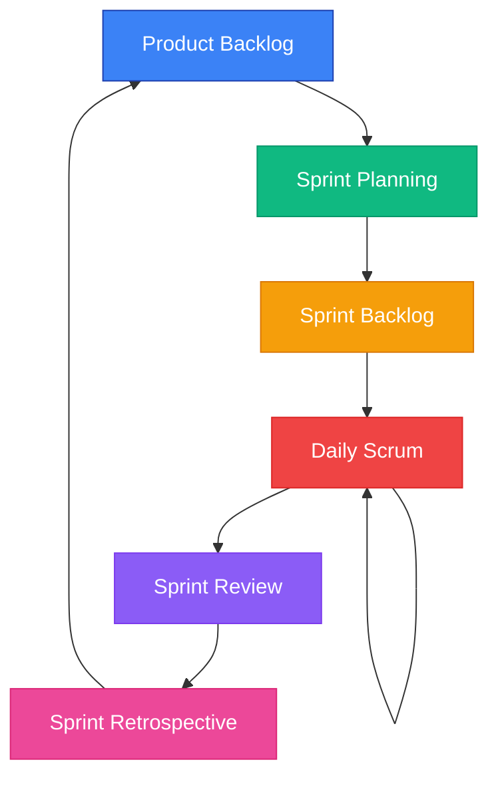
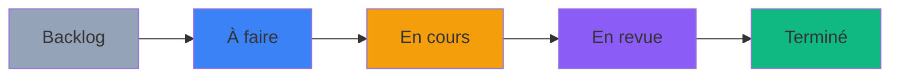
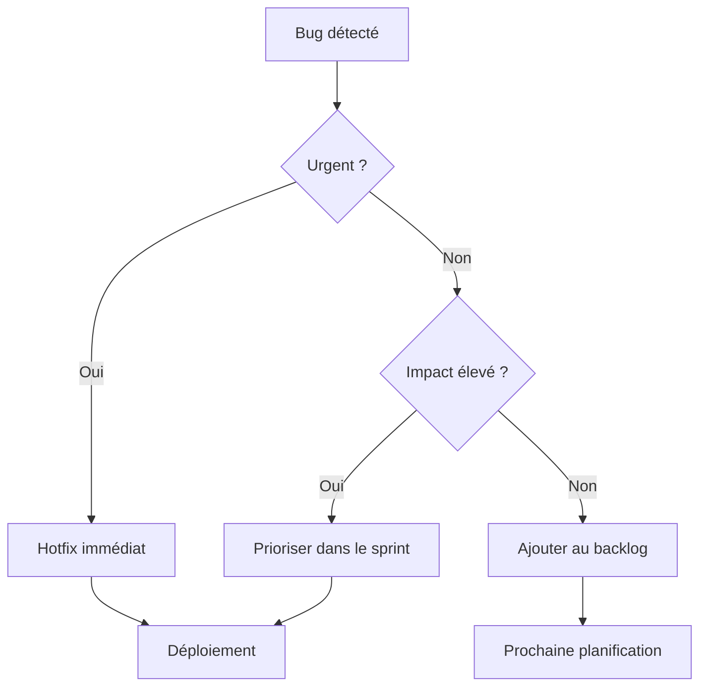
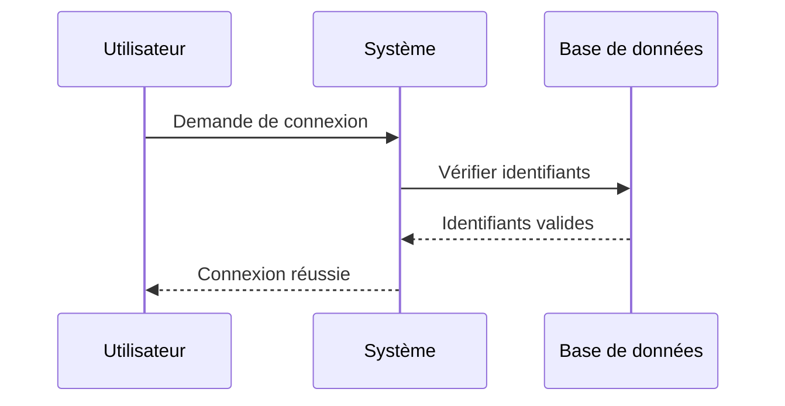
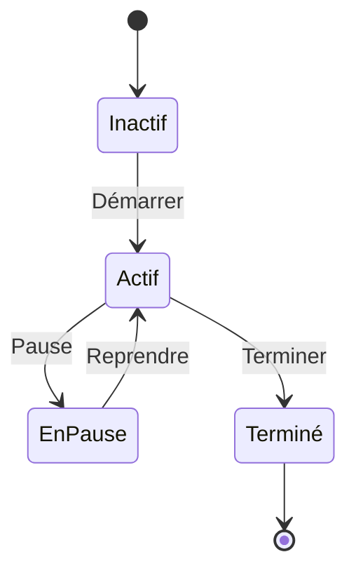
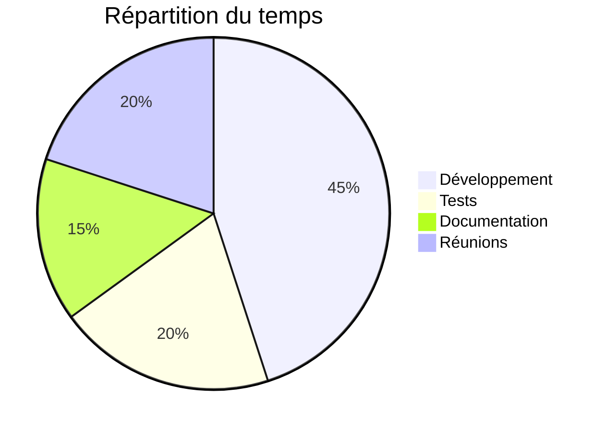

# Test d'Intégration Mermaid.js

Ce document teste l'intégration de **Mermaid.js** dans le système de rendu Markdown.

## 🎯 Impact Mapping

Voici un exemple d'Impact Mapping avec Mermaid :

**Explication** : Ce diagramme montre les 4 niveaux de l'Impact Mapping, de l'objectif aux livrables.

---

## 🔄 Cycle Scrum

Le cycle Scrum peut être représenté ainsi :

**Note** : Les couleurs permettent de différencier visuellement chaque étape du cycle.

---

## 📊 Flux de Travail Kanban

Un workflow Kanban simple :

---

## 🔀 Diagramme de Décision

Exemple d'arbre de décision pour la gestion des bugs :

---

## 💬 Diagramme de Séquence

Interaction utilisateur-système :

---

## 📈 Diagramme d'État

États d'un processus :

---

## 🥧 Diagramme Circulaire

Répartition du temps de travail :

---

## ✅ Validation

Si vous voyez tous les diagrammes ci-dessus correctement rendus, l'intégration Mermaid.js fonctionne parfaitement ! 🎉

### Points à vérifier

- ✅ Les diagrammes sont rendus (pas de code brut)
- ✅ Les couleurs sont appliquées
- ✅ Les sauts de ligne (`\n`) fonctionnent
- ✅ Les flèches et connexions sont visibles
- ✅ Le style s'adapte au thème du site

---

**Créé pour Coach Agile Toolkit**  
*Test d'intégration Mermaid.js v1.0*
